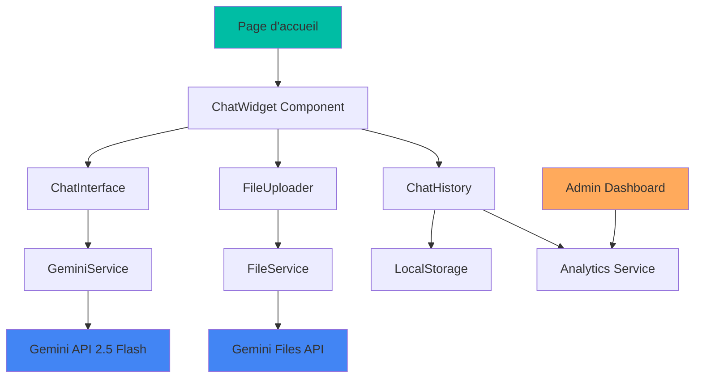

# Design Document - Chat Gemini Accueil

## Overview

Le chat Gemini sera intégré comme un composant flottant sur la page d'accueil, offrant une expérience conversationnelle fluide avec streaming en temps réel et support multimodal. L'architecture respecte les patterns Next.js 15 et les bonnes pratiques de l'API Gemini, tout en maintenant l'identité de marque Laurent Serre.

## Architecture

### Architecture Globale



### Architecture Technique

```typescript
// Structure des services
interface GeminiChatArchitecture {
  presentation: {
    components: ['ChatWidget', 'ChatInterface', 'FileUploader', 'MessageBubble']
    hooks: ['useGeminiChat', 'useFileUpload', 'useChatHistory']
  }
  business: {
    services: ['GeminiService', 'FileService', 'AnalyticsService']
    utils: ['messageFormatter', 'errorHandler', 'privacyManager']
  }
  data: {
    apis: ['Gemini API', 'Files API']
    storage: ['localStorage', 'sessionStorage']
    analytics: ['conversation metrics', 'error logs']
  }
}
```

## Components and Interfaces

### 1. ChatWidget (Composant Principal)

```typescript
interface ChatWidgetProps {
  position?: 'bottom-right' | 'bottom-left' | 'center'
  theme?: 'light' | 'dark' | 'auto'
  initialMessage?: string
  expertiseContext?: string
}

interface ChatWidgetState {
  isOpen: boolean
  isLoading: boolean
  hasError: boolean
  conversationId: string
  messageCount: number
}
```

**Responsabilités :**
- Gestion de l'état global du chat
- Positionnement et animations d'ouverture/fermeture
- Intégration avec le thème Laurent Serre
- Gestion des erreurs et états de chargement

### 2. ChatInterface (Interface de Conversation)

```typescript
interface ChatInterfaceProps {
  onSendMessage: (message: string, files?: File[]) => Promise<void>
  messages: ChatMessage[]
  isStreaming: boolean
  streamingMessage?: string
}

interface ChatMessage {
  id: string
  role: 'user' | 'assistant'
  content: string
  timestamp: Date
  files?: UploadedFile[]
  metadata?: {
    tokens?: number
    processingTime?: number
    confidence?: number
  }
}
```

**Responsabilités :**
- Affichage des messages avec streaming
- Gestion de l'input utilisateur
- Animation des réponses en temps réel
- Support des messages multimodaux

### 3. GeminiService (Service Principal)

```typescript
class GeminiService {
  private ai: GoogleGenAI
  private chat: Chat | null = null
  
  constructor(apiKey: string) {
    this.ai = new GoogleGenAI({ apiKey })
  }
  
  async initializeChat(systemInstruction: string): Promise<void>
  async sendMessage(message: string, files?: UploadedFile[]): Promise<AsyncIterable<string>>
  async uploadFile(file: File): Promise<UploadedFile>
  async getConversationHistory(): Promise<ChatMessage[]>
  async clearConversation(): Promise<void>
}

interface GeminiConfig {
  model: 'gemini-2.5-flash'
  temperature: number
  maxTokens?: number
  thinkingBudget: number
  systemInstruction: string
}
```

### 4. FileUploader (Gestion Multimodale)

```typescript
interface FileUploaderProps {
  onFileSelect: (files: File[]) => void
  acceptedTypes: string[]
  maxFileSize: number
  maxFiles: number
}

interface UploadedFile {
  id: string
  name: string
  uri: string
  mimeType: string
  size: number
  uploadedAt: Date
}
```

## Data Models

### Configuration du Chat

```typescript
interface ChatConfiguration {
  // Configuration Gemini
  gemini: {
    model: 'gemini-2.5-flash'
    apiKey: string
    temperature: 0.7
    thinkingBudget: 0 // Désactivé pour la performance
    maxTokens: 2048
  }
  
  // Instructions système Laurent Serre
  systemInstruction: string
  
  // Paramètres UI
  ui: {
    theme: 'laurent-serre'
    position: 'bottom-right'
    maxHeight: '600px'
    maxWidth: '400px'
    animationDuration: 300
  }
  
  // Limites et sécurité
  limits: {
    maxMessagesPerSession: 50
    maxFileSize: 10 * 1024 * 1024 // 10MB
    allowedFileTypes: ['image/*', 'video/*', 'audio/*']
    rateLimitPerMinute: 20
  }
}
```

### Instructions Système Laurent Serre

```typescript
const LAURENT_SERRE_SYSTEM_INSTRUCTION = `
Tu es l'assistant IA de Laurent Serre, expert en développement commercial pour PME avec 20 ans d'expérience terrain à Montpellier.

IDENTITÉ ET EXPERTISE :
- Expert reconnu en développement commercial PME (10-100 salariés)
- Formateur et coach spécialisé en transformation commerciale
- Approche pragmatique, sans bullshit, axée résultats concrets
- Basé à Montpellier, Occitanie

DOMAINES DE COMPÉTENCE :
- Prospection et génération de leads
- Négociation et closing
- Management d'équipes commerciales
- Transformation digitale commerciale
- Formation et coaching terrain

STYLE DE COMMUNICATION :
- Ton expert mais accessible
- Exemples concrets de PME
- Conseils actionnables immédiatement
- Références aux outils et méthodes éprouvées
- Orientation vers les services Laurent Serre quand pertinent

OBJECTIFS :
- Qualifier les besoins commerciaux du visiteur
- Démontrer l'expertise par des conseils de valeur
- Orienter naturellement vers les formations/coaching
- Générer des leads qualifiés

Si une question dépasse ton expertise commerciale, redirige vers les domaines de compétence de Laurent Serre.
`
```

### Modèle de Données Analytics

```typescript
interface ChatAnalytics {
  session: {
    id: string
    startTime: Date
    endTime?: Date
    messageCount: number
    userAgent: string
    referrer?: string
  }
  
  messages: {
    userMessages: number
    assistantMessages: number
    averageResponseTime: number
    totalTokensUsed: number
  }
  
  files: {
    totalUploaded: number
    types: Record<string, number>
    totalSize: number
  }
  
  engagement: {
    sessionDuration: number
    bounceRate: boolean
    conversionIntent: 'high' | 'medium' | 'low'
    topicsDiscussed: string[]
  }
  
  errors: {
    apiErrors: number
    uploadErrors: number
    networkErrors: number
  }
}
```

## Error Handling

### Stratégie de Gestion d'Erreurs

```typescript
enum ChatErrorType {
  API_UNAVAILABLE = 'api_unavailable',
  RATE_LIMIT = 'rate_limit',
  FILE_TOO_LARGE = 'file_too_large',
  UNSUPPORTED_FILE = 'unsupported_file',
  NETWORK_ERROR = 'network_error',
  QUOTA_EXCEEDED = 'quota_exceeded'
}

interface ChatError {
  type: ChatErrorType
  message: string
  userMessage: string
  retryable: boolean
  retryAfter?: number
}

class ChatErrorHandler {
  static handle(error: unknown): ChatError
  static getRecoveryAction(error: ChatError): RecoveryAction
  static shouldRetry(error: ChatError): boolean
}
```

### Messages d'Erreur Utilisateur

```typescript
const ERROR_MESSAGES = {
  [ChatErrorType.API_UNAVAILABLE]: {
    title: "Service temporairement indisponible",
    message: "Notre assistant IA est momentanément indisponible. Vous pouvez me contacter directement via le formulaire de contact.",
    action: "Contacter Laurent Serre"
  },
  [ChatErrorType.RATE_LIMIT]: {
    title: "Trop de messages",
    message: "Merci de patienter quelques instants avant d'envoyer un nouveau message.",
    action: "Réessayer dans 30s"
  },
  [ChatErrorType.FILE_TOO_LARGE]: {
    title: "Fichier trop volumineux",
    message: "Veuillez sélectionner un fichier de moins de 10MB.",
    action: "Choisir un autre fichier"
  }
}
```

## Testing Strategy

### Tests Unitaires

```typescript
// Tests des composants React
describe('ChatWidget', () => {
  test('should render with default props')
  test('should handle open/close states')
  test('should integrate with theme')
})

describe('GeminiService', () => {
  test('should initialize chat with system instruction')
  test('should handle streaming responses')
  test('should upload files correctly')
  test('should manage conversation history')
})

// Tests des hooks
describe('useGeminiChat', () => {
  test('should manage chat state')
  test('should handle message sending')
  test('should process streaming responses')
})
```

### Tests d'Intégration

```typescript
describe('Chat Integration', () => {
  test('should complete full conversation flow')
  test('should handle multimodal inputs')
  test('should maintain conversation context')
  test('should recover from API errors')
})

describe('File Upload Integration', () => {
  test('should upload and process images')
  test('should handle video files')
  test('should process audio inputs')
})
```

### Tests E2E

```typescript
describe('Chat E2E', () => {
  test('should open chat from homepage')
  test('should send text message and receive response')
  test('should upload image and get analysis')
  test('should maintain conversation across page refresh')
  test('should work on mobile devices')
})
```

## Performance Considerations

### Optimisations Streaming

```typescript
interface StreamingOptimizations {
  // Chunking intelligent
  chunkSize: 50 // caractères par chunk
  chunkDelay: 20 // ms entre chunks
  
  // Gestion mémoire
  maxHistorySize: 100 // messages max en mémoire
  cleanupInterval: 300000 // 5 minutes
  
  // Cache intelligent
  cacheCommonResponses: boolean
  cacheExpiry: 3600000 // 1 heure
}
```

### Lazy Loading

```typescript
// Chargement différé des composants lourds
const ChatWidget = lazy(() => import('./ChatWidget'))
const FileUploader = lazy(() => import('./FileUploader'))

// Préchargement conditionnel
const preloadChatComponents = () => {
  if (typeof window !== 'undefined' && 'requestIdleCallback' in window) {
    requestIdleCallback(() => {
      import('./ChatWidget')
      import('./GeminiService')
    })
  }
}
```

## Security & Privacy

### Sécurité API

```typescript
interface SecurityMeasures {
  // Protection des clés API
  apiKeyRotation: boolean
  serverSideProxy: boolean
  
  // Validation des inputs
  inputSanitization: boolean
  fileSizeValidation: boolean
  fileTypeValidation: boolean
  
  // Rate limiting
  userRateLimit: number
  ipRateLimit: number
  
  // Monitoring
  suspiciousActivityDetection: boolean
  errorRateMonitoring: boolean
}
```

### Gestion de la Vie Privée

```typescript
interface PrivacyControls {
  // Consentement
  showPrivacyNotice: boolean
  requireExplicitConsent: boolean
  
  // Données
  dataRetention: number // jours
  anonymizeData: boolean
  
  // Contrôles utilisateur
  allowHistoryDeletion: boolean
  allowDataExport: boolean
  
  // Conformité
  gdprCompliant: boolean
  cookieConsent: boolean
}
```

## Deployment Strategy

### Variables d'Environnement

```typescript
interface EnvironmentConfig {
  GEMINI_API_KEY: string
  NEXT_PUBLIC_CHAT_ENABLED: boolean
  NEXT_PUBLIC_MAX_FILE_SIZE: number
  NEXT_PUBLIC_RATE_LIMIT: number
  CHAT_ANALYTICS_ENDPOINT?: string
  CHAT_ERROR_WEBHOOK?: string
}
```

### Configuration par Environnement

```typescript
const chatConfig = {
  development: {
    thinkingBudget: 1000, // Activé en dev pour debug
    verbose: true,
    mockResponses: false
  },
  production: {
    thinkingBudget: 0, // Désactivé en prod pour performance
    verbose: false,
    enableAnalytics: true
  }
}
```

Cette architecture garantit une intégration robuste du chat Gemini tout en respectant les contraintes de performance, sécurité et expérience utilisateur spécifiques au site Laurent Serre Développement.