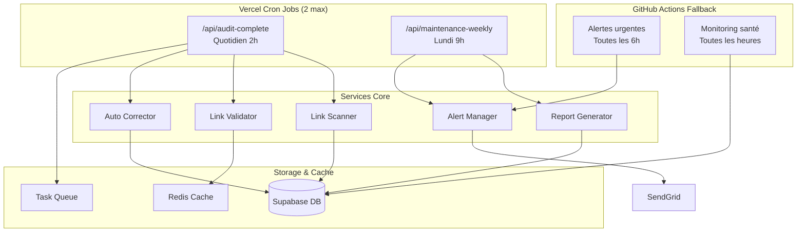

# Design Document - Optimisation Vercel Plan Gratuit

## Overview

Cette solution transforme le système d'audit actuel (4 cron jobs) en un système optimisé (2 cron jobs) qui respecte les limites du plan Vercel Hobby tout en préservant toutes les fonctionnalités. L'approche principale est la **consolidation intelligente** avec des **fallbacks robustes**.

## Architecture

### Vue d'ensemble du système optimisé



### Consolidation des Cron Jobs

#### 1. `/api/audit-complete` (Quotidien - 2h00)
**Responsabilités consolidées :**
- Audit complet des 498 liens
- Traitement de la queue des tâches
- Vérification des alertes critiques
- Corrections automatiques
- Notifications urgentes

**Optimisations :**
- Traitement par batch de 10 liens simultanés
- Cache des résultats pour 6h
- Timeout réduit à 5s par requête
- Lazy loading des modules non-critiques

#### 2. `/api/maintenance-weekly` (Hebdomadaire - Lundi 9h)
**Responsabilités consolidées :**
- Génération du rapport hebdomadaire
- Nettoyage de la base de données
- Calcul des métriques et analytics
- Maintenance préventive
- Vérification des quotas Vercel

## Components and Interfaces

### 1. Consolidated Audit Engine

```typescript
interface ConsolidatedAuditConfig {
  batchSize: number;           // 10 liens par batch
  maxConcurrency: number;      // 3 batches simultanés
  cacheTimeout: number;        // 6 heures
  requestTimeout: number;      // 5 secondes
  retryAttempts: number;       // 2 tentatives max
}

interface AuditResult {
  totalLinks: number;
  validLinks: number;
  brokenLinks: number;
  corrections: AutoCorrection[];
  alerts: Alert[];
  executionTime: number;
  resourceUsage: ResourceMetrics;
}
```

### 2. Intelligent Task Queue

```typescript
interface TaskQueue {
  addTask(task: AuditTask, priority: Priority): void;
  processBatch(batchSize: number): Promise<TaskResult[]>;
  getQueueStatus(): QueueMetrics;
  clearCompletedTasks(): void;
}

interface AuditTask {
  id: string;
  type: 'link_check' | 'correction' | 'alert' | 'report';
  payload: any;
  priority: 'critical' | 'high' | 'medium' | 'low';
  createdAt: Date;
  attempts: number;
}
```

### 3. Resource Usage Monitor

```typescript
interface VercelUsageMonitor {
  getCurrentUsage(): Promise<UsageMetrics>;
  predictMonthlyUsage(): Promise<UsagePrediction>;
  checkLimits(): Promise<LimitStatus>;
  sendUsageAlert(threshold: number): Promise<void>;
}

interface UsageMetrics {
  functionInvocations: number;
  computeHours: number;
  percentageOfLimit: number;
  projectedMonthly: number;
}
```

### 4. Fallback System

```typescript
interface FallbackManager {
  registerFallback(service: string, fallbackFn: Function): void;
  executeFallback(service: string, params: any): Promise<any>;
  checkFallbackHealth(): Promise<HealthStatus>;
}

// GitHub Actions comme fallback principal
interface GitHubActionsFallback {
  triggerWorkflow(workflow: string, inputs: any): Promise<void>;
  checkWorkflowStatus(runId: string): Promise<WorkflowStatus>;
  getWorkflowLogs(runId: string): Promise<string[]>;
}
```

## Data Models

### 1. Optimized Audit Record

```typescript
interface OptimizedAuditRecord {
  id: string;
  timestamp: Date;
  totalLinks: number;
  results: {
    valid: number;
    broken: number;
    redirected: number;
    timeout: number;
  };
  performance: {
    executionTime: number;
    memoryUsed: number;
    cpuTime: number;
    cacheHitRate: number;
  };
  vercelUsage: {
    invocations: number;
    computeHours: number;
  };
  corrections: AutoCorrection[];
  alerts: Alert[];
}
```

### 2. Resource Usage Tracking

```typescript
interface ResourceUsageLog {
  date: Date;
  service: string;
  invocations: number;
  computeHours: number;
  memoryPeak: number;
  errors: number;
  cacheHits: number;
  cacheMisses: number;
}
```

## Error Handling

### 1. Graceful Degradation Strategy

```typescript
enum ServiceLevel {
  FULL = 'full',           // Toutes fonctionnalités
  ESSENTIAL = 'essential', // Audit de base seulement
  MINIMAL = 'minimal',     // Alertes critiques seulement
  FALLBACK = 'fallback'    // GitHub Actions seulement
}

interface DegradationManager {
  assessSystemLoad(): ServiceLevel;
  adjustServiceLevel(level: ServiceLevel): void;
  notifyDegradation(level: ServiceLevel): void;
}
```

### 2. Circuit Breaker Pattern

```typescript
interface CircuitBreaker {
  state: 'CLOSED' | 'OPEN' | 'HALF_OPEN';
  failureCount: number;
  lastFailureTime: Date;
  execute<T>(operation: () => Promise<T>): Promise<T>;
  reset(): void;
}
```

## Testing Strategy

### 1. Load Testing
- **Simulation de charge** : 498 liens traités en 3 minutes max
- **Test de mémoire** : Consommation < 512MB par fonction
- **Test de timeout** : Aucune fonction > 30 secondes
- **Test de concurrence** : 3 batches simultanés sans conflit

### 2. Resource Usage Testing
- **Monitoring continu** des métriques Vercel
- **Simulation mensuelle** pour valider les projections
- **Test des seuils d'alerte** (70%, 80%, 90% des limites)
- **Validation des fallbacks** en cas de dépassement

### 3. Integration Testing
- **Test de consolidation** : Toutes les fonctionnalités dans 2 cron jobs
- **Test de migration** : Passage de l'ancien au nouveau système
- **Test de rollback** : Retour à l'ancienne configuration
- **Test des fallbacks** : GitHub Actions en cas d'échec Vercel

## Performance Optimizations

### 1. Caching Strategy

```typescript
interface CacheStrategy {
  linkResults: {
    ttl: 6 * 60 * 60 * 1000; // 6 heures
    key: (url: string) => string;
  };
  sitemapData: {
    ttl: 24 * 60 * 60 * 1000; // 24 heures
    key: 'sitemap_cache';
  };
  reportData: {
    ttl: 7 * 24 * 60 * 60 * 1000; // 7 jours
    key: (date: string) => string;
  };
}
```

### 2. Batch Processing

```typescript
interface BatchProcessor {
  batchSize: 10;
  maxConcurrency: 3;
  processBatch<T>(items: T[], processor: (item: T) => Promise<any>): Promise<any[]>;
  processWithBackpressure<T>(items: T[], processor: (item: T) => Promise<any>): Promise<any[]>;
}
```

### 3. Memory Management

```typescript
interface MemoryOptimizer {
  streamProcessing: boolean;    // Traitement en streaming
  garbageCollection: boolean;   // GC forcé après chaque batch
  memoryLimit: 512;            // MB max par fonction
  monitorMemory(): MemoryStats;
}
```

## Migration Plan

### Phase 1: Preparation (1 jour)
1. **Backup complet** de la configuration actuelle
2. **Tests en local** du nouveau système
3. **Validation** des fallbacks GitHub Actions
4. **Préparation** des scripts de rollback

### Phase 2: Deployment (2 heures)
1. **Déploiement** du nouveau vercel.json (2 cron jobs)
2. **Migration** des API routes consolidées
3. **Test immédiat** des nouvelles fonctions
4. **Validation** du monitoring

### Phase 3: Monitoring (7 jours)
1. **Surveillance** des métriques d'usage
2. **Validation** des performances
3. **Ajustements** si nécessaire
4. **Documentation** des résultats

### Phase 4: Cleanup (1 jour)
1. **Suppression** des anciens cron jobs
2. **Nettoyage** du code obsolète
3. **Mise à jour** de la documentation
4. **Formation** de l'équipe

## Monitoring and Alerting

### 1. Usage Monitoring Dashboard

```typescript
interface UsageDashboard {
  realTimeMetrics: {
    currentInvocations: number;
    currentComputeHours: number;
    percentageUsed: number;
  };
  projections: {
    monthlyInvocations: number;
    monthlyComputeHours: number;
    upgradeRecommendation: boolean;
  };
  alerts: {
    threshold70: boolean;
    threshold80: boolean;
    threshold90: boolean;
  };
}
```

### 2. Performance Alerts

```typescript
interface PerformanceAlerts {
  slowFunction: (duration: number) => void;      // > 10 secondes
  highMemoryUsage: (memory: number) => void;     // > 400MB
  highErrorRate: (rate: number) => void;         // > 5%
  quotaWarning: (percentage: number) => void;    // > 70%
}
```

## Security Considerations

### 1. Resource Protection
- **Rate limiting** sur les API routes
- **Validation** des inputs pour éviter les attaques
- **Monitoring** des patterns d'usage anormaux
- **Circuit breakers** pour éviter les cascading failures

### 2. Data Protection
- **Chiffrement** des données sensibles en cache
- **Rotation** des clés API
- **Audit trail** des actions administratives
- **Backup** sécurisé des configurations

## Scalability Considerations

### 1. Horizontal Scaling Options
- **GitHub Actions** comme compute supplémentaire
- **Edge functions** pour les tâches légères
- **Webhooks** pour les notifications temps réel
- **CDN caching** pour les rapports statiques

### 2. Upgrade Path to Vercel Pro
- **Configuration modulaire** pour extension facile
- **Métriques ROI** pour justifier l'upgrade
- **Migration automatisée** vers plus de cron jobs
- **Monitoring avancé** avec alertes personnalisées

---

## Conclusion

Cette architecture optimisée permet de :
- **Respecter** les limites Vercel Hobby (2 cron jobs, <100 GB-heures/mois)
- **Préserver** toutes les fonctionnalités existantes
- **Améliorer** les performances avec le cache et les optimisations
- **Assurer** la résilience avec les fallbacks GitHub Actions
- **Faciliter** l'évolution future vers un plan payant si nécessaire

Le système sera plus robuste, plus efficient et parfaitement adapté aux contraintes du plan gratuit.