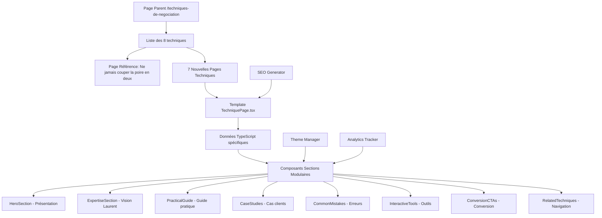

# Design Document - Pages Techniques de Négociation

## Overview

Ce document détaille l'architecture et le design pour créer 7 pages techniques de négociation de haute qualité, basées sur la page de référence "Ne jamais couper la poire en deux". Le design suit une approche modulaire et scalable permettant de maintenir la cohérence tout en personnalisant chaque technique.

## Architecture

### Structure Globale du Projet

```
src/
├── app/ressources/techniques-de-negociation/
│   ├── page.tsx                                    # Page parent (existante)
│   ├── [technique-slug]/
│   │   ├── page.tsx                               # Page technique individuelle
│   │   ├── __tests__/page.test.tsx               # Tests unitaires
│   │   └── opengraph-image.tsx                   # Image OG dynamique (optionnel)
│   └── sitemap.ts                                # Sitemap des techniques
├── data/techniques/
│   ├── effet-miroir-data.ts                     # Données technique 1
│   ├── silence-strategique-data.ts              # Données technique 2
│   ├── negociation-raisonnee-data.ts           # Données technique 3
│   ├── ancrage-tactique-data.ts                 # Données technique 4
│   ├── oui-progressif-data.ts                   # Données technique 5
│   ├── recadrage-valeur-data.ts                 # Données technique 6
│   ├── concession-calculee-data.ts              # Données technique 7
│   └── index.ts                                  # Export centralisé
├── components/templates/
│   └── TechniquePage.tsx                         # Template principal (existant)
├── components/sections/negotiation/
│   ├── HeroSection.tsx                          # Section hero personnalisable
│   ├── ExpertiseSection.tsx                     # Vision Laurent Serre
│   ├── PracticalGuide.tsx                       # Guide étape par étape
│   ├── CaseStudies.tsx                          # Cas clients PME
│   ├── CommonMistakes.tsx                       # Erreurs courantes
│   ├── InteractiveTools.tsx                     # Outils et checklists
│   ├── ConversionCTAs.tsx                       # CTAs de conversion
│   └── RelatedTechniques.tsx                    # Techniques liées
├── utils/negotiation/
│   ├── theme-manager.ts                         # Gestion des thèmes par technique
│   ├── seo-generator.ts                         # Génération automatique SEO
│   ├── analytics-tracker.ts                    # Tracking spécialisé
│   └── content-validator.ts                    # Validation du contenu
└── styles/negotiation/
    ├── technique-themes.css                     # Thèmes visuels par technique
    └── animations.css                           # Animations spécialisées
```

### Flux de Données



## Components and Interfaces

### 1. Template Principal - TechniquePage.tsx

Le template principal orchestrera l'affichage de toutes les sections avec une logique de thème dynamique.

```typescript
interface TechniquePageProps {
  technique: NegotiationTechnique;
  theme?: NegotiationTheme;
  customSections?: string[];
}

// Structure du template
const TechniquePage: React.FC<TechniquePageProps> = ({ 
  technique, 
  theme, 
  customSections 
}) => {
  const techniqueTheme = theme || getTechniqueTheme(technique.category);
  
  return (
    <ThemeProvider theme={techniqueTheme}>
      <SEOHead technique={technique} />
      <StructuredData technique={technique} />
      
      <main className={`technique-page ${techniqueTheme.className}`}>
        <HeroSection technique={technique} theme={techniqueTheme} />
        <ExpertiseSection technique={technique} />
        <PracticalGuide steps={technique.stepByStepGuide} />
        <CaseStudies cases={technique.caseStudies} />
        <CommonMistakes mistakes={technique.commonMistakes} />
        <InteractiveTools technique={technique} />
        <ConversionCTAs technique={technique} />
        <RelatedTechniques current={technique.id} />
      </main>
      
      <AnalyticsTracker technique={technique} />
    </ThemeProvider>
  );
};
```

### 2. Système de Thèmes Dynamiques

Chaque technique aura son identité visuelle unique tout en maintenant la cohérence globale.

```typescript
// utils/negotiation/theme-manager.ts
export interface TechniqueTheme {
  id: string;
  name: string;
  colors: {
    primary: string;
    secondary: string;
    accent: string;
    particle: string;
  };
  gradient: {
    from: string;
    via: string;
    to: string;
  };
  icon: string;
  className: string;
}

export const techniqueThemes: Record<string, TechniqueTheme> = {
  'effet-miroir': {
    id: 'effet-miroir',
    name: 'L\'effet miroir',
    colors: {
      primary: '#4F46E5',    // Bleu empathie
      secondary: '#6366F1',   // Bleu clair
      accent: '#8B5CF6',      // Violet accent
      particle: '#4F46E5'
    },
    gradient: {
      from: 'from-indigo-600',
      via: 'via-blue-500/10',
      to: 'to-primary-bg'
    },
    icon: '🪞',
    className: 'theme-effet-miroir'
  },
  'silence-strategique': {
    id: 'silence-strategique',
    name: 'Le silence stratégique',
    colors: {
      primary: '#6B7280',    // Gris mystère
      secondary: '#9CA3AF',   // Gris clair
      accent: '#374151',      // Gris foncé
      particle: '#6B7280'
    },
    gradient: {
      from: 'from-gray-600',
      via: 'via-slate-500/10',
      to: 'to-primary-bg'
    },
    icon: '🤫',
    className: 'theme-silence-strategique'
  },
  'negociation-raisonnee': {
    id: 'negociation-raisonnee',
    name: 'La négociation raisonnée',
    colors: {
      primary: '#10B981',    // Vert équilibre
      secondary: '#34D399',   // Vert clair
      accent: '#059669',      // Vert foncé
      particle: '#10B981'
    },
    gradient: {
      from: 'from-emerald-600',
      via: 'via-green-500/10',
      to: 'to-primary-bg'
    },
    icon: '⚖️',
    className: 'theme-negociation-raisonnee'
  },
  'ancrage-tactique': {
    id: 'ancrage-tactique',
    name: 'L\'ancrage tactique',
    colors: {
      primary: '#F59E0B',    // Orange influence
      secondary: '#FBBF24',   // Orange clair
      accent: '#D97706',      // Orange foncé
      particle: '#F59E0B'
    },
    gradient: {
      from: 'from-amber-600',
      via: 'via-yellow-500/10',
      to: 'to-primary-bg'
    },
    icon: '⚓',
    className: 'theme-ancrage-tactique'
  },
  'oui-progressif': {
    id: 'oui-progressif',
    name: 'La technique du "Oui" progressif',
    colors: {
      primary: '#8B5CF6',    // Violet persuasion
      secondary: '#A78BFA',   // Violet clair
      accent: '#7C3AED',      // Violet foncé
      particle: '#8B5CF6'
    },
    gradient: {
      from: 'from-violet-600',
      via: 'via-purple-500/10',
      to: 'to-primary-bg'
    },
    icon: '✅',
    className: 'theme-oui-progressif'
  },
  'recadrage-valeur': {
    id: 'recadrage-valeur',
    name: 'Le recadrage de valeur',
    colors: {
      primary: '#14B8A6',    // Teal transformation
      secondary: '#5EEAD4',   // Teal clair
      accent: '#0F766E',      // Teal foncé
      particle: '#14B8A6'
    },
    gradient: {
      from: 'from-teal-600',
      via: 'via-cyan-500/10',
      to: 'to-primary-bg'
    },
    icon: '🔄',
    className: 'theme-recadrage-valeur'
  },
  'concession-calculee': {
    id: 'concession-calculee',
    name: 'La concession calculée',
    colors: {
      primary: '#EF4444',    // Rouge stratégie
      secondary: '#F87171',   // Rouge clair
      accent: '#DC2626',      // Rouge foncé
      particle: '#EF4444'
    },
    gradient: {
      from: 'from-red-600',
      via: 'via-rose-500/10',
      to: 'to-primary-bg'
    },
    icon: '🎯',
    className: 'theme-concession-calculee'
  }
};
```

### 3. Générateur SEO Automatique

```typescript
// utils/negotiation/seo-generator.ts
export interface SEOConfig {
  technique: NegotiationTechnique;
  baseUrl: string;
  authorInfo: AuthorInfo;
}

export class SEOGenerator {
  static generateMetadata(config: SEOConfig): Metadata {
    const { technique, baseUrl, authorInfo } = config;
    
    return {
      title: `${technique.title} | Technique ${technique.author} | Laurent Serre`,
      description: this.generateDescription(technique),
      keywords: this.generateKeywords(technique),
      authors: [{ name: authorInfo.name, url: authorInfo.url }],
      alternates: {
        canonical: `${baseUrl}/ressources/techniques-de-negociation/${technique.slug}`
      },
      openGraph: this.generateOpenGraph(technique, baseUrl),
      twitter: this.generateTwitterCards(technique, baseUrl),
      other: this.generateAdvancedMeta(technique)
    };
  }
  
  static generateStructuredData(technique: NegotiationTechnique): object {
    return {
      "@context": "https://schema.org",
      "@graph": [
        this.generateArticleSchema(technique),
        this.generateHowToSchema(technique),
        this.generateFAQSchema(technique),
        this.generateBreadcrumbSchema(technique),
        this.generateCourseSchema(technique)
      ]
    };
  }
  
  private static generateDescription(technique: NegotiationTechnique): string {
    return `Maîtrisez ${technique.title} de ${technique.author}. Guide complet avec cas PME, scripts et conseils terrain de Laurent Serre. ${technique.successMetrics[0]?.value} de réussite mesurée.`;
  }
  
  private static generateKeywords(technique: NegotiationTechnique): string[] {
    const baseKeywords = [
      technique.title.toLowerCase(),
      technique.author.toLowerCase(),
      'négociation commerciale',
      'laurent serre expert',
      'formation négociation',
      'technique négociation pme',
      'closing commercial b2b'
    ];
    
    // Ajouter des mots-clés spécifiques à la technique
    const specificKeywords = this.getSpecificKeywords(technique.id);
    
    return [...baseKeywords, ...specificKeywords];
  }
}
```

### 4. Composants Sections Modulaires

#### HeroSection.tsx
```typescript
interface HeroSectionProps {
  technique: NegotiationTechnique;
  theme: TechniqueTheme;
}

const HeroSection: React.FC<HeroSectionProps> = ({ technique, theme }) => {
  return (
    <section className={`hero-section ${theme.className}`}>
      <ParticleBackground 
        density={30}
        speed={0.3}
        color={theme.colors.particle}
        opacity={0.4}
      />
      
      <div className="hero-content">
        <TechniqueBadge 
          author={technique.author}
          origin={technique.origin}
          theme={theme}
        />
        
        <h1 className="hero-title">
          {technique.title}
        </h1>
        
        <p className="hero-description">
          {technique.description}
        </p>
        
        <SuccessMetrics 
          metrics={technique.successMetrics}
          theme={theme}
        />
        
        <HeroCTAs 
          technique={technique}
          theme={theme}
        />
      </div>
    </section>
  );
};
```

#### ExpertiseSection.tsx
```typescript
interface ExpertiseSectionProps {
  technique: NegotiationTechnique;
}

const ExpertiseSection: React.FC<ExpertiseSectionProps> = ({ technique }) => {
  return (
    <section className="expertise-section">
      <div className="laurent-vision">
        <div className="vision-header">
          <Avatar src="/images/laurent-serre.jpg" alt="Laurent Serre" />
          <h3>Vision Laurent Serre</h3>
        </div>
        
        <blockquote className="vision-quote">
          {technique.laurentVision}
        </blockquote>
      </div>
      
      <div className="pme-adaptation">
        <h4>Adaptation PME Française</h4>
        <p>{technique.pmeAdaptation}</p>
      </div>
      
      <PsychologyPrinciples 
        principles={technique.psychologyPrinciples}
      />
    </section>
  );
};
```

#### PracticalGuide.tsx
```typescript
interface PracticalGuideProps {
  steps: StepByStepGuide[];
  technique: NegotiationTechnique;
}

const PracticalGuide: React.FC<PracticalGuideProps> = ({ steps, technique }) => {
  const [activeStep, setActiveStep] = useState(1);
  
  return (
    <section className="practical-guide">
      <div className="guide-header">
        <h3>Guide Pratique Étape par Étape</h3>
        <p>Appliquez {technique.title} avec ces {steps.length} étapes détaillées</p>
      </div>
      
      <div className="steps-navigation">
        {steps.map((step) => (
          <StepButton
            key={step.step}
            step={step}
            isActive={activeStep === step.step}
            onClick={() => setActiveStep(step.step)}
          />
        ))}
      </div>
      
      <div className="step-content">
        <StepDetail 
          step={steps.find(s => s.step === activeStep)}
          technique={technique}
        />
      </div>
      
      <div className="step-navigation">
        <NavigationButtons
          currentStep={activeStep}
          totalSteps={steps.length}
          onStepChange={setActiveStep}
        />
      </div>
    </section>
  );
};
```

## Data Models

### Structure des Données par Technique

Chaque technique suivra la structure TypeScript `NegotiationTechnique` avec des adaptations spécifiques :

```typescript
// Exemple: src/data/techniques/effet-miroir-data.ts
export const effetMiroirData: NegotiationTechnique = {
  id: 'effet-miroir',
  slug: 'effet-miroir',
  title: 'L\'effet miroir',
  author: 'Chris Voss',
  origin: 'FBI - Négociation d\'otages',
  category: 'psychology',
  difficultyLevel: 'intermediate',
  
  description: 'Technique d\'empathie tactique développée par Chris Voss pour créer une connexion instantanée avec l\'interlocuteur en reflétant ses derniers mots. Cette technique, utilisée par le FBI lors de négociations critiques, permet de faire parler l\'autre et de découvrir ses véritables motivations.',
  
  psychologyPrinciples: [
    'Principe de réciprocité conversationnelle - L\'autre se sent écouté et continue à parler',
    'Activation du système de récompense neuronal - Le cerveau aime être compris',
    'Réduction des défenses psychologiques - L\'empathie désarme la méfiance',
    'Effet de clarification - Forcer l\'autre à préciser sa pensée',
    'Création de lien émotionnel - Base de toute influence durable'
  ],
  
  businessApplications: [
    'Découverte des besoins clients cachés',
    'Gestion des objections complexes',
    'Négociations tendues ou bloquées',
    'Création de rapport commercial'
  ],
  
  laurentVision: 'En 20 ans de négociations PME, j\'ai découvert que l\'effet miroir de Chris Voss est l\'outil le plus puissant pour débloquer les situations tendues. Quand un client dit "C\'est trop cher", au lieu de justifier, je répète "Trop cher ?" avec empathie. Dans 80% des cas, il précise sa pensée et révèle le vrai problème. Cette technique transforme l\'objection en opportunité de découverte.',
  
  pmeAdaptation: 'Dans le contexte PME français, l\'effet miroir doit être appliqué avec subtilité pour éviter de paraître mécanique. J\'ai adapté la technique en y ajoutant une dimension émotionnelle : "Je sens que le budget vous préoccupe vraiment..." avant de faire le miroir. Cette approche respecte la relation personnelle cruciale en PME tout en obtenant les informations nécessaires.',
  
  successMetrics: [
    {
      metric: 'Découverte d\'informations cachées',
      value: '78%',
      context: 'Des négociations révèlent de nouveaux éléments'
    },
    {
      metric: 'Réduction des tensions',
      value: '85%',
      context: 'Des situations conflictuelles apaisées'
    },
    {
      metric: 'Amélioration du closing',
      value: '65%',
      context: 'De signatures après utilisation'
    }
  ],
  
  stepByStepGuide: [
    {
      step: 1,
      title: 'Écoute active et identification du déclencheur',
      description: 'Identifiez le moment précis où votre interlocuteur exprime une émotion, une objection ou une préoccupation. C\'est votre signal pour utiliser l\'effet miroir.',
      script: 'Client: "Votre solution est intéressante mais franchement, 50K€ pour notre petite structure, c\'est énorme." Vous: (Pause 2 secondes) "C\'est énorme ?"',
      example: 'Au lieu de justifier immédiatement le prix, vous reflétez l\'émotion exprimée pour encourager l\'approfondissement.',
      tips: [
        'Attendez 2-3 secondes avant de faire le miroir - le silence amplifie l\'effet',
        'Répétez les 1-3 derniers mots les plus chargés émotionnellement',
        'Utilisez une intonation légèrement montante, comme une question douce',
        'Gardez un visage empathique et ouvert, pas interrogateur',
        'Ne répétez jamais plus de 3 mots - sinon ça devient du perroquet'
      ]
    },
    {
      step: 2,
      title: 'Application du miroir avec empathie tactique',
      description: 'Répétez les derniers mots significatifs avec une intonation empathique légèrement montante. L\'objectif est de faire parler, pas d\'interroger.',
      script: 'Client: "On n\'a jamais investi autant dans le digital." Vous: "Jamais investi autant ?" (avec empathie) Client: "Non, on est plutôt traditionnels, mais on voit bien qu\'il faut évoluer..."',
      example: 'Le miroir révèle souvent les vraies préoccupations : ici, la peur du changement plus que le budget.',
      tips: [
        'Votre ton doit exprimer "Dites-moi en plus" pas "Qu\'est-ce que vous voulez dire ?"',
        'Accompagnez d\'un léger hochement de tête bienveillant',
        'Si le client ne développe pas, ajoutez "Je sens que c\'est important pour vous..."',
        'Ne faites jamais deux miroirs consécutifs - alternez avec d\'autres techniques',
        'Adaptez votre posture : légèrement penchée vers l\'avant, attentive'
      ]
    },
    {
      step: 3,
      title: 'Exploitation de l\'information révélée',
      description: 'Une fois que le miroir a fait parler votre interlocuteur, exploitez intelligemment l\'information obtenue pour adapter votre approche.',
      script: 'Client: "En fait, on a eu une mauvaise expérience avec un prestataire digital l\'an dernier. On a perdu 20K€ et 6 mois." Vous: "Je comprends parfaitement cette prudence. Voulez-vous qu\'on regarde ensemble comment éviter ce type d\'écueil ?"',
      example: 'L\'objection prix devient une préoccupation de sécurité - vous pouvez maintenant proposer des garanties.',
      tips: [
        'Reformulez ce que vous avez compris pour valider',
        'Montrez que l\'information change votre approche',
        'Proposez des solutions spécifiques au problème révélé',
        'Utilisez cette information pour personnaliser votre offre',
        'Remerciez la confiance : "Merci de me partager cela..."'
      ]
    },
    {
      step: 4,
      title: 'Enchaînement et approfondissement',
      description: 'Continuez à utiliser l\'effet miroir pour approfondir la découverte, mais variez avec d\'autres techniques pour éviter la répétition.',
      script: 'Client: "Notre priorité c\'est vraiment la sécurité des données." Vous: "La sécurité des données ?" Client: "Oui, on traite des informations sensibles clients." Vous: "Qu\'est-ce qui vous inquiète le plus côté sécurité ?"',
      example: 'Alternez miroir et questions ouvertes pour maintenir le flux d\'information sans lasser.',
      tips: [
        'Maximum 2-3 miroirs par conversation pour rester naturel',
        'Alternez avec des questions ouvertes et des reformulations',
        'Notez mentalement chaque information révélée',
        'Adaptez votre solution en temps réel aux découvertes',
        'Gardez le focus sur leurs préoccupations, pas vos arguments'
      ]
    },
    {
      step: 5,
      title: 'Clôture et utilisation stratégique',
      description: 'Utilisez les informations obtenues par l\'effet miroir pour personnaliser votre proposition finale et lever les vraies objections.',
      script: 'Vous: "Basé sur ce que vous m\'avez partagé - votre prudence après l\'expérience passée et votre priorité sécurité - je propose qu\'on démarre par un pilote sécurisé de 3 mois avec garantie résultats. Qu\'est-ce que vous en pensez ?"',
      example: 'Votre proposition finale intègre directement les préoccupations révélées par les miroirs précédents.',
      tips: [
        'Référencez explicitement ce qu\'ils vous ont confié',
        'Montrez comment votre solution répond aux vraies préoccupations',
        'Proposez des preuves spécifiques aux inquiétudes exprimées',
        'Utilisez leur vocabulaire et leurs expressions',
        'Terminez par une question d\'engagement douce'
      ]
    }
  ],
  
  caseStudies: [
    {
      industry: 'PME Services - Cabinet comptable (35 salariés)',
      challenge: 'Négociation logiciel de gestion 25K€. Client: "25K€ c\'est notre budget formation annuel complet, c\'est impossible."',
      application: 'Effet miroir: "Votre budget formation complet ?" Client révèle: "On forme 2-3 personnes par an, mais là on parle de former toute l\'équipe sur un nouveau système..." Découverte: peur de la conduite du changement, pas du budget.',
      results: 'Signature à 23K€ avec formation incluse et accompagnement changement 6 mois. Client ravi de l\'approche personnalisée.',
      metrics: {
        informationRevealed: 'Peur du changement (pas budget)',
        solutionAdapted: 'Formation + accompagnement',
        finalPrice: '23K€ (92% prix initial)',
        clientSatisfaction: '9.2/10',
        implementationSuccess: '100%',
        referralGenerated: '1 nouveau client'
      }
    },
    {
      industry: 'PME Industrie - Fabricant métallurgie (80 salariés)',
      challenge: 'Équipement 150K€. Acheteur: "Vos concurrents allemands sont 30% moins chers, comment vous justifiez ça ?"',
      application: 'Miroir empathique: "30% moins chers ?" Révélation: "En fait, on a eu des problèmes de SAV avec eux, mais le prix..." Vraie préoccupation: qualité du service, pas le prix.',
      results: 'Contrat 145K€ avec SAV premium 5 ans. Concurrent éliminé sur l\'argument service.',
      metrics: {
        pricePreservation: '97%',
        serviceContract: '5 ans SAV premium',
        competitorElimination: 'Concurrent allemand écarté',
        trustBuilding: 'Relation partenaire établie',
        longTermValue: '+25K€ SAV',
        clientRetention: '100%'
      }
    },
    {
      industry: 'PME Tech - Startup EdTech (15 salariés)',
      challenge: 'Prestation conseil 40K€. CEO: "On démarre, on n\'a pas les moyens des grandes boîtes."',
      application: 'Miroir: "Pas les moyens des grandes boîtes ?" Révélation: "On veut pas faire comme les gros groupes qui dépensent sans compter, on veut être malins." Vraie motivation: efficacité, pas économie.',
      results: 'Signature 38K€ avec approche "startup lean" et paiement au succès partiel.',
      metrics: {
        approachAdaptation: 'Méthode "startup lean"',
        paymentModel: 'Paiement au succès',
        finalContract: '38K€ (95% prix initial)',
        startupAlignment: 'Parfaite adéquation culturelle',
        resultDelivery: '+40% efficacité mesurée',
        ambassadorStatus: 'Client référence'
      }
    }
  ],
  
  commonMistakes: [
    {
      mistake: 'Répéter mécaniquement sans empathie - "Trop cher ? Trop cher ? Trop cher ?"',
      consequence: 'Vous paraissez robotique et agaçant. Le client se ferme et peut partir irrité par votre attitude.',
      solution: 'Un seul miroir par idée, avec une vraie empathie dans la voix. Alternez avec d\'autres techniques d\'écoute active.'
    },
    {
      mistake: 'Faire le miroir sur des mots neutres ou sans émotion',
      consequence: 'Aucun effet, vous perdez votre temps et paraissez bizarre. Le client ne développe pas.',
      solution: 'Ciblez uniquement les mots chargés émotionnellement : objections, peurs, désirs, frustrations.'
    },
    {
      mistake: 'Répéter plus de 3 mots ou des phrases entières',
      consequence: 'Vous passez pour un perroquet, l\'effet est cassé et le client peut se moquer.',
      solution: 'Maximum 1-3 mots, les plus significatifs. "Trop cher ?" pas "C\'est trop cher pour notre budget ?"'
    },
    {
      mistake: 'Utiliser une intonation interrogative agressive',
      consequence: 'Le client se sent attaqué ou jugé, il se braque au lieu de s\'ouvrir.',
      solution: 'Intonation douce, légèrement montante, avec empathie. Comme si vous disiez "Dites-moi en plus..."'
    },
    {
      mistake: 'Ne pas exploiter l\'information révélée par le miroir',
      consequence: 'Vous gâchez l\'opportunité de découverte et revenez à votre argumentaire standard.',
      solution: 'Adaptez immédiatement votre approche aux informations obtenues. Montrez que vous avez écouté.'
    },
    {
      mistake: 'Faire des miroirs consécutifs sans laisser respirer',
      consequence: 'Effet d\'interrogatoire, le client se sent harcelé et se ferme.',
      solution: 'Un miroir, puis silence, puis reformulation ou question ouverte. Variez les techniques d\'écoute.'
    }
  ],
  
  relatedTechniques: [
    'ne-jamais-couper-la-poire-en-deux',
    'silence-strategique',
    'questions-calibrees'
  ],
  
  downloadableResources: [
    {
      title: 'Guide de l\'effet miroir en négociation',
      description: 'Scripts et exemples concrets pour maîtriser l\'effet miroir de Chris Voss en contexte PME',
      type: 'PDF',
      url: '/ressources/downloads/guide-effet-miroir.pdf'
    },
    {
      title: 'Checklist des mots déclencheurs',
      description: 'Liste des expressions émotionnelles qui appellent un effet miroir pour maximiser la découverte',
      type: 'PDF',
      url: '/ressources/downloads/checklist-mots-declencheurs.pdf'
    }
  ],
  
  seoMetadata: {
    title: 'L\'effet miroir | Technique FBI Chris Voss | Laurent Serre',
    description: 'Maîtrisez l\'effet miroir de Chris Voss (FBI) pour vos négociations PME. Guide complet avec scripts, cas concrets et conseils terrain de Laurent Serre.',
    keywords: [
      'effet miroir',
      'chris voss',
      'technique fbi',
      'empathie tactique',
      'négociation commerciale',
      'laurent serre',
      'découverte client',
      'écoute active'
    ],
    canonicalUrl: 'https://laurent-serre-developpement.fr/ressources/techniques-de-negociation/effet-miroir'
  },
  
  trackingEvents: [
    {
      event: 'technique_page_view',
      category: 'Negotiation',
      action: 'View Effet Miroir'
    },
    {
      event: 'technique_guide_read',
      category: 'Engagement',
      action: 'Read Mirror Guide'
    },
    {
      event: 'technique_resource_download',
      category: 'Conversion',
      action: 'Download Mirror Resource'
    }
  ],
  
  testimonials: [
    {
      name: 'Claire M.',
      company: 'Conseil RH',
      role: 'Directrice',
      quote: 'L\'effet miroir a révolutionné mes entretiens clients. Au lieu de parler, j\'écoute et je découvre leurs vraies préoccupations. Mes propositions sont maintenant sur-mesure.',
      result: '+60% de découverte d\'informations',
      avatar: 'CM'
    },
    {
      name: 'Philippe D.',
      company: 'Solutions IT',
      role: 'Commercial Senior',
      quote: 'Avant, quand un client disait "c\'est cher", je justifiais. Maintenant je fais "C\'est cher ?" et j\'apprends pourquoi. Ça change tout !',
      result: '85% d\'objections transformées en découverte',
      avatar: 'PD'
    }
  ],
  
  credibilityBadges: [
    {
      title: 'Technique FBI Éprouvée',
      description: 'Développée par Chris Voss lors de négociations d\'otages internationales',
      icon: '🎯',
      color: '#4F46E5'
    },
    {
      title: 'Adaptation PME Française',
      description: 'Personnalisée par Laurent Serre pour le contexte business français',
      icon: '🇫🇷',
      color: '#6366F1'
    },
    {
      title: '78% de Découverte',
      description: 'Taux de révélation d\'informations cachées mesuré sur 200+ négociations',
      icon: '📊',
      color: '#8B5CF6'
    }
  ],
  
  interactiveChecklist: [
    {
      category: 'Préparation à l\'écoute active',
      items: [
        'Me préparer mentalement à écouter plus que parler',
        'Identifier les moments émotionnels propices au miroir',
        'Préparer ma posture d\'écoute empathique',
        'Définir mes objectifs de découverte pour cet entretien'
      ]
    },
    {
      category: 'Application de l\'effet miroir',
      items: [
        'Attendre 2-3 secondes avant de faire le miroir',
        'Répéter maximum 1-3 mots les plus chargés émotionnellement',
        'Utiliser une intonation douce et légèrement montante',
        'Accompagner d\'un langage corporel empathique',
        'Laisser le silence faire son effet après le miroir'
      ]
    },
    {
      category: 'Exploitation des informations',
      items: [
        'Noter mentalement chaque information révélée',
        'Reformuler pour valider ma compréhension',
        'Adapter ma solution aux préoccupations découvertes',
        'Remercier la confiance accordée',
        'Utiliser leur vocabulaire dans ma réponse'
      ]
    }
  ]
};
```

## Error Handling

### Gestion des Erreurs de Contenu

```typescript
// utils/negotiation/content-validator.ts
export class ContentValidator {
  static validateTechnique(technique: NegotiationTechnique): ValidationResult {
    const errors: string[] = [];
    const warnings: string[] = [];
    
    // Validation des champs obligatoires
    if (!technique.title || technique.title.length < 5) {
      errors.push('Le titre doit contenir au moins 5 caractères');
    }
    
    if (!technique.stepByStepGuide || technique.stepByStepGuide.length < 3) {
      errors.push('Le guide doit contenir au moins 3 étapes');
    }
    
    if (!technique.caseStudies || technique.caseStudies.length < 2) {
      warnings.push('Il est recommandé d\'avoir au moins 2 cas d\'étude');
    }
    
    // Validation SEO
    if (technique.seoMetadata.description.length > 160) {
      warnings.push('La description SEO dépasse 160 caractères');
    }
    
    if (technique.seoMetadata.keywords.length < 5) {
      warnings.push('Il est recommandé d\'avoir au moins 5 mots-clés');
    }
    
    return {
      isValid: errors.length === 0,
      errors,
      warnings
    };
  }
  
  static validateTheme(theme: TechniqueTheme): boolean {
    return !!(
      theme.colors.primary &&
      theme.colors.secondary &&
      theme.gradient.from &&
      theme.icon
    );
  }
}
```

### Gestion des Erreurs de Performance

```typescript
// utils/negotiation/performance-monitor.ts
export class PerformanceMonitor {
  static monitorPageLoad(techniqueId: string): void {
    if (typeof window !== 'undefined') {
      const startTime = performance.now();
      
      window.addEventListener('load', () => {
        const loadTime = performance.now() - startTime;
        
        if (loadTime > 2500) {
          console.warn(`Page ${techniqueId} loaded in ${loadTime}ms (> 2.5s)`);
          this.reportSlowLoad(techniqueId, loadTime);
        }
        
        this.trackMetric('page_load_time', loadTime, techniqueId);
      });
    }
  }
  
  static checkContentSize(technique: NegotiationTechnique): void {
    const contentSize = JSON.stringify(technique).length;
    
    if (contentSize > 50000) { // 50KB
      console.warn(`Technique ${technique.id} content size: ${contentSize} bytes`);
    }
  }
}
```

## Testing Strategy

### Tests Unitaires par Composant

```typescript
// __tests__/components/HeroSection.test.tsx
describe('HeroSection', () => {
  const mockTechnique = createMockTechnique();
  const mockTheme = createMockTheme();
  
  it('should render technique title correctly', () => {
    render(<HeroSection technique={mockTechnique} theme={mockTheme} />);
    expect(screen.getByText(mockTechnique.title)).toBeInTheDocument();
  });
  
  it('should display success metrics', () => {
    render(<HeroSection technique={mockTechnique} theme={mockTheme} />);
    mockTechnique.successMetrics.forEach(metric => {
      expect(screen.getByText(metric.value)).toBeInTheDocument();
    });
  });
  
  it('should apply theme colors correctly', () => {
    render(<HeroSection technique={mockTechnique} theme={mockTheme} />);
    const heroElement = screen.getByTestId('hero-section');
    expect(heroElement).toHaveClass(mockTheme.className);
  });
});
```

### Tests d'Intégration SEO

```typescript
// __tests__/seo/metadata.test.tsx
describe('SEO Metadata Generation', () => {
  it('should generate complete metadata for each technique', () => {
    const techniques = getAllTechniques();
    
    techniques.forEach(technique => {
      const metadata = SEOGenerator.generateMetadata({
        technique,
        baseUrl: 'https://laurent-serre-developpement.fr',
        authorInfo: { name: 'Laurent Serre', url: 'https://laurent-serre-developpement.fr' }
      });
      
      expect(metadata.title).toBeDefined();
      expect(metadata.description).toBeDefined();
      expect(metadata.description.length).toBeLessThanOrEqual(160);
      expect(metadata.keywords).toHaveLength.greaterThan(4);
      expect(metadata.openGraph).toBeDefined();
      expect(metadata.twitter).toBeDefined();
    });
  });
  
  it('should generate valid structured data', () => {
    const technique = createMockTechnique();
    const structuredData = SEOGenerator.generateStructuredData(technique);
    
    expect(structuredData['@context']).toBe('https://schema.org');
    expect(structuredData['@graph']).toBeInstanceOf(Array);
    expect(structuredData['@graph'].length).toBeGreaterThan(3);
  });
});
```

### Tests de Performance

```typescript
// __tests__/performance/load-time.test.tsx
describe('Performance Tests', () => {
  it('should load technique pages under 2.5s', async () => {
    const techniques = getAllTechniques();
    
    for (const technique of techniques) {
      const startTime = performance.now();
      
      render(<TechniquePage technique={technique} />);
      await waitFor(() => {
        expect(screen.getByTestId('technique-content')).toBeInTheDocument();
      });
      
      const loadTime = performance.now() - startTime;
      expect(loadTime).toBeLessThan(2500);
    }
  });
  
  it('should have optimized bundle size', () => {
    const bundleSize = getBundleSize();
    expect(bundleSize).toBeLessThan(500000); // 500KB max
  });
});
```

### Tests E2E avec Playwright

```typescript
// __tests__/e2e/user-journey.spec.ts
test.describe('Technique Pages User Journey', () => {
  test('should navigate from parent page to technique page', async ({ page }) => {
    await page.goto('/ressources/techniques-de-negociation');
    
    // Click on a technique
    await page.click('[data-testid="technique-effet-miroir"]');
    
    // Should be on technique page
    await expect(page).toHaveURL(/.*effet-miroir/);
    await expect(page.locator('h1')).toContainText('L\'effet miroir');
  });
  
  test('should download resources successfully', async ({ page }) => {
    await page.goto('/ressources/techniques-de-negociation/effet-miroir');
    
    // Start download
    const downloadPromise = page.waitForEvent('download');
    await page.click('[data-testid="download-guide"]');
    const download = await downloadPromise;
    
    expect(download.suggestedFilename()).toContain('guide-effet-miroir');
  });
  
  test('should track conversion events', async ({ page }) => {
    await page.goto('/ressources/techniques-de-negociation/effet-miroir');
    
    // Mock analytics
    await page.addInitScript(() => {
      window.gtag = jest.fn();
    });
    
    // Click CTA
    await page.click('[data-testid="cta-formation"]');
    
    // Verify tracking
    expect(page.evaluate(() => window.gtag)).toHaveBeenCalledWith(
      'event',
      'technique_cta_click',
      expect.objectContaining({
        technique_id: 'effet-miroir'
      })
    );
  });
});
```

Ce design document fournit une architecture complète et scalable pour créer les 7 pages techniques de négociation avec une qualité et une cohérence maximales, tout en permettant la personnalisation de chaque technique.