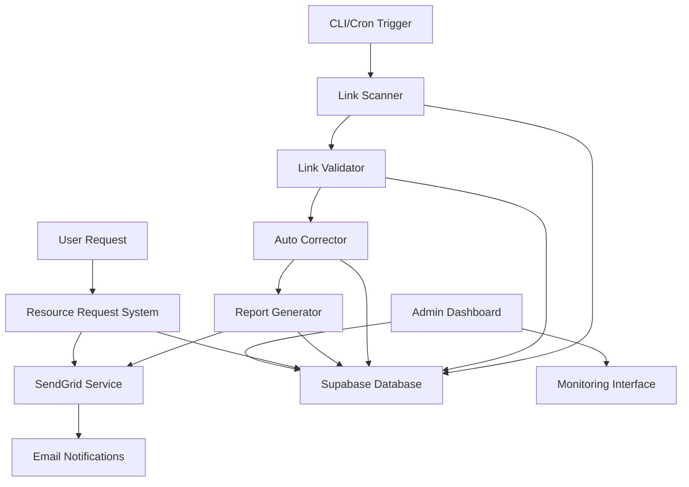

# Guide technique - Système d'audit des liens morts

## 🏗️ Architecture du système

### Vue d'ensemble



### Composants principaux

1. **Link Scanner** : Découverte et extraction des liens
2. **Link Validator** : Validation HTTP et locale
3. **Auto Corrector** : Corrections automatiques intelligentes
4. **Report Generator** : Génération de rapports multi-formats
5. **SendGrid Service** : Gestion des notifications email
6. **Resource Request System** : Gestion des demandes utilisateurs

## 📁 Structure du code

```
src/lib/audit/
├── config.ts                 # Configuration centralisée
├── types.ts                  # Types TypeScript
├── database.ts               # Interface Supabase
├── link-scanner.ts           # Scanner principal
├── file-scanner.ts           # Scanner de fichiers
├── sitemap-scanner.ts        # Scanner de sitemap
├── link-classifier.ts        # Classification des liens
├── link-validator.ts         # Validateur principal
├── local-file-validator.ts   # Validation fichiers locaux
├── batch-validator.ts        # Validation par lots
├── auto-corrector.ts         # Correcteur automatique
├── report-generator.ts       # Générateur de rapports
├── html-report-generator.ts  # Rapports HTML
├── csv-export-generator.ts   # Export CSV
└── scheduler.ts              # Planificateur d'audits

src/lib/email/
├── sendgrid-service.ts       # Service SendGrid
├── resource-request-system.ts # Système de demandes
├── priority-calculator.ts    # Calcul de priorité
├── resource-request-analytics.ts # Analytics
└── templates/                # Templates d'emails
    ├── resource-request.html
    ├── audit-alert.html
    ├── auto-response.html
    └── weekly-report.html

src/components/admin/
├── AuditDashboard.tsx        # Dashboard principal
├── MetricCard.tsx            # Cartes de métriques
├── LinkHealthChart.tsx       # Graphique santé liens
├── BrokenLinksTable.tsx      # Tableau liens morts
├── ResourceRequestsChart.tsx # Graphique demandes
├── AuditHistoryChart.tsx     # Historique audits
├── SEOImpactPanel.tsx        # Panel impact SEO
├── AlertSettings.tsx         # Configuration alertes
└── SchedulerManager.tsx      # Gestion planification

scripts/cli/
├── audit-cli.ts              # Interface CLI principale
├── maintenance-utils.ts      # Utilitaires maintenance
└── README.md                 # Documentation CLI

src/__tests__/audit/
├── unit/                     # Tests unitaires
├── integration/              # Tests d'intégration
├── performance/              # Tests de performance
└── test-runner.ts            # Runner de tests
```

## 🔧 Configuration technique

### Types TypeScript principaux

```typescript
// Configuration du scanner
interface LinkScannerConfig {
  baseUrl: string
  maxDepth: number
  includeExternal: boolean
  excludePatterns: string[]
  followRedirects: boolean
}

// Configuration du validateur
interface ValidationConfig {
  timeout: number
  retryAttempts: number
  userAgent: string
  followRedirects: boolean
  checkAnchors: boolean
  batchSize: number
  rateLimitDelay: number
}

// Lien scanné
interface ScannedLink {
  url: string
  sourceFile: string
  sourceLine: number
  linkType: 'internal' | 'external' | 'download' | 'anchor'
  context: string
  priority: 'critical' | 'high' | 'medium' | 'low'
}

// Résultat de validation
interface ValidationResult {
  url: string
  status: 'valid' | 'broken' | 'redirect' | 'timeout' | 'unknown'
  statusCode?: number
  redirectUrl?: string
  error?: string
  responseTime: number
  lastChecked: Date
}

// Suggestion de correction
interface CorrectionSuggestion {
  originalUrl: string
  suggestedUrl: string
  confidence: number
  correctionType: 'typo' | 'extension' | 'redirect' | 'moved' | 'similar'
  reasoning: string
}
```

### Base de données Supabase

#### Schéma des tables

```sql
-- Table des liens scannés
CREATE TABLE scanned_links (
  id BIGINT GENERATED ALWAYS AS IDENTITY PRIMARY KEY,
  url TEXT NOT NULL,
  source_file TEXT NOT NULL,
  source_line INTEGER,
  link_type TEXT NOT NULL CHECK (link_type IN ('internal', 'external', 'download', 'anchor')),
  priority TEXT NOT NULL CHECK (priority IN ('critical', 'high', 'medium', 'low')),
  context TEXT,
  created_at TIMESTAMPTZ DEFAULT NOW(),
  updated_at TIMESTAMPTZ DEFAULT NOW()
);

-- Table des résultats de validation
CREATE TABLE validation_results (
  id BIGINT GENERATED ALWAYS AS IDENTITY PRIMARY KEY,
  url TEXT NOT NULL,
  status TEXT NOT NULL CHECK (status IN ('valid', 'broken', 'redirect', 'timeout', 'unknown')),
  status_code INTEGER,
  redirect_url TEXT,
  error_message TEXT,
  response_time INTEGER,
  checked_at TIMESTAMPTZ DEFAULT NOW()
);

-- Table des corrections appliquées
CREATE TABLE applied_corrections (
  id BIGINT GENERATED ALWAYS AS IDENTITY PRIMARY KEY,
  original_url TEXT NOT NULL,
  corrected_url TEXT NOT NULL,
  file_path TEXT NOT NULL,
  correction_type TEXT NOT NULL,
  confidence DECIMAL(3,2),
  rollback_id TEXT UNIQUE,
  applied_at TIMESTAMPTZ DEFAULT NOW(),
  rollback_data JSONB
);

-- Table des demandes de ressources
CREATE TABLE resource_requests (
  id BIGINT GENERATED ALWAYS AS IDENTITY PRIMARY KEY,
  requested_url TEXT NOT NULL,
  user_email TEXT NOT NULL,
  message TEXT,
  source_url TEXT NOT NULL,
  status TEXT DEFAULT 'pending',
  priority INTEGER DEFAULT 1,
  request_count INTEGER DEFAULT 1,
  created_at TIMESTAMPTZ DEFAULT NOW(),
  updated_at TIMESTAMPTZ DEFAULT NOW()
);

-- Table de l'historique des audits
CREATE TABLE audit_history (
  id BIGINT GENERATED ALWAYS AS IDENTITY PRIMARY KEY,
  total_links INTEGER,
  broken_links INTEGER,
  corrected_links INTEGER,
  seo_score DECIMAL(5,2),
  report_path TEXT,
  execution_time INTEGER,
  created_at TIMESTAMPTZ DEFAULT NOW()
);
```

#### Index pour les performances

```sql
-- Index pour optimiser les requêtes fréquentes
CREATE INDEX idx_scanned_links_url ON scanned_links(url);
CREATE INDEX idx_scanned_links_type_priority ON scanned_links(link_type, priority);
CREATE INDEX idx_validation_results_url_status ON validation_results(url, status);
CREATE INDEX idx_validation_results_checked_at ON validation_results(checked_at);
CREATE INDEX idx_resource_requests_url ON resource_requests(requested_url);
CREATE INDEX idx_resource_requests_status ON resource_requests(status);
CREATE INDEX idx_applied_corrections_rollback_id ON applied_corrections(rollback_id);
```

## 🔍 Algorithmes de détection

### Scanner de liens

Le scanner utilise plusieurs stratégies :

1. **Analyse statique** : Parse des fichiers TypeScript/JSX
2. **Analyse dynamique** : Crawling du sitemap généré
3. **Extraction par regex** : Détection des patterns de liens
4. **Classification intelligente** : Catégorisation automatique

```typescript
class LinkScanner {
  async scanSite(config: LinkScannerConfig): Promise<ScannedLink[]> {
    const fileLinks = await this.fileScanner.scanDirectory('./src', config.excludePatterns)
    const sitemapLinks = await this.sitemapScanner.scanSitemap()
    
    const allLinks = [...fileLinks, ...sitemapLinks]
    
    return allLinks.map(link => ({
      ...link,
      priority: this.linkClassifier.calculatePriority(link),
      linkType: this.linkClassifier.classifyLink(link.url)
    }))
  }
}
```

### Validation par lots

Optimisation pour traiter de gros volumes :

```typescript
class BatchValidator {
  async validateBatch(urls: string[], config: ValidationConfig): Promise<ValidationResult[]> {
    const batches = this.createBatches(urls, config.batchSize)
    const results: ValidationResult[] = []
    
    for (const batch of batches) {
      const batchResults = await Promise.allSettled(
        batch.map(url => this.validateSingleUrl(url, config))
      )
      
      results.push(...this.processBatchResults(batchResults))
      
      // Rate limiting
      await this.delay(config.rateLimitDelay)
    }
    
    return results
  }
}
```

### Auto-correction intelligente

Algorithmes de suggestion de corrections :

```typescript
class AutoCorrector {
  async suggestCorrections(brokenLinks: ScannedLink[]): Promise<CorrectionSuggestion[]> {
    const suggestions: CorrectionSuggestion[] = []
    
    for (const link of brokenLinks) {
      // 1. Détection de fautes de frappe
      const typoSuggestions = await this.detectTypos(link.url)
      
      // 2. Recherche d'extensions alternatives
      const extensionSuggestions = await this.findAlternativeExtensions(link.url)
      
      // 3. Détection de pages déplacées
      const movedSuggestions = await this.detectMovedPages(link.url)
      
      // 4. Recherche de pages similaires
      const similarSuggestions = await this.findSimilarUrls(link.url)
      
      suggestions.push(
        ...typoSuggestions,
        ...extensionSuggestions,
        ...movedSuggestions,
        ...similarSuggestions
      )
    }
    
    return suggestions.sort((a, b) => b.confidence - a.confidence)
  }
}
```

## 📧 Intégration SendGrid

### Configuration du service

```typescript
class SendGridEmailService {
  constructor(config: SendGridConfig) {
    sgMail.setApiKey(config.apiKey)
    this.config = config
  }
  
  async sendResourceRequest(request: ResourceRequestEmail): Promise<boolean> {
    try {
      const template = this.generateResourceRequestTemplate(request)
      
      await sgMail.send({
        to: this.config.adminEmail,
        from: {
          email: this.config.fromEmail,
          name: this.config.fromName
        },
        subject: template.subject,
        html: template.htmlContent,
        text: template.textContent
      })
      
      return true
    } catch (error) {
      console.error('❌ Erreur SendGrid:', error)
      return false
    }
  }
}
```

### Templates d'emails

Les templates utilisent un système de variables :

```html
<!-- resource-request.html -->
<!DOCTYPE html>
<html lang="fr">
<head>
    <meta charset="UTF-8">
    <title>Nouvelle demande de ressource</title>
    <style>
        /* Styles CSS intégrés pour compatibilité email */
        body { font-family: Arial, sans-serif; }
        .container { max-width: 600px; margin: 0 auto; }
        .header { background: linear-gradient(135deg, #1B365D, #00BDA4); }
    </style>
</head>
<body>
    <div class="container">
        <div class="header">
            <h1>🚨 Nouvelle demande de ressource</h1>
        </div>
        
        <div class="content">
            <p><strong>📧 Email :</strong> {{userEmail}}</p>
            <p><strong>📄 Ressource :</strong> {{resourceUrl}}</p>
            <p><strong>🌐 Source :</strong> {{sourceUrl}}</p>
            <p><strong>📊 Demandes :</strong> {{requestCount}} fois</p>
            
            {{#if message}}
            <div class="message">
                <strong>💬 Message :</strong>
                <p>{{message}}</p>
            </div>
            {{/if}}
        </div>
    </div>
</body>
</html>
```

## 🎯 Système de priorisation

### Calcul de priorité des liens

```typescript
class LinkClassifier {
  calculatePriority(link: ScannedLink): Priority {
    let score = 0
    
    // Facteur 1: Type de fichier source
    if (link.sourceFile.includes('layout.tsx')) score += 10
    if (link.sourceFile.includes('page.tsx')) score += 8
    if (link.sourceFile.includes('navigation')) score += 7
    if (link.sourceFile.includes('footer')) score += 3
    
    // Facteur 2: Type de lien
    if (link.linkType === 'internal') score += 5
    if (link.linkType === 'download') score += 4
    if (link.linkType === 'external') score += 2
    
    // Facteur 3: Contexte du lien
    if (link.context.includes('nav')) score += 6
    if (link.context.includes('hero')) score += 5
    if (link.context.includes('cta')) score += 4
    
    // Classification finale
    if (score >= 15) return 'critical'
    if (score >= 10) return 'high'
    if (score >= 5) return 'medium'
    return 'low'
  }
}
```

### Calcul de priorité des demandes

```typescript
class PriorityCalculator {
  calculateRequestPriority(request: ResourceRequest): number {
    const baseScore = request.requestCount * 2
    const seoImpact = this.calculateSEOImpact(request.requestedUrl)
    const ageBonus = this.calculateAgeBonus(request.createdAt)
    
    return baseScore + seoImpact + ageBonus
  }
  
  private calculateSEOImpact(url: string): number {
    // URLs importantes ont plus d'impact
    if (url.includes('/downloads/')) return 5
    if (url.includes('/guides/')) return 4
    if (url.includes('/resources/')) return 3
    return 1
  }
}
```

## 📊 Génération de rapports

### Rapport HTML interactif

```typescript
class HtmlReportGenerator {
  async generateReport(report: AuditReport): Promise<string> {
    const template = await this.loadTemplate('audit-report.html')
    
    const data = {
      timestamp: report.timestamp.toLocaleString('fr-FR'),
      summary: report.summary,
      brokenLinks: report.brokenLinks.map(link => ({
        ...link,
        priorityClass: this.getPriorityClass(link.priority),
        impactBadge: this.getImpactBadge(link.seoImpact)
      })),
      charts: {
        healthScore: this.generateHealthScoreChart(report.summary.seoHealthScore),
        linkTypes: this.generateLinkTypesChart(report.brokenLinks),
        timeline: this.generateTimelineChart(report.corrections)
      }
    }
    
    return this.renderTemplate(template, data)
  }
}
```

### Export CSV structuré

```typescript
class CsvExportGenerator {
  async exportToCSV(report: AuditReport): Promise<string> {
    const headers = [
      'URL',
      'Status',
      'Error',
      'Priority',
      'SEO Impact',
      'Source Files',
      'Suggested Actions',
      'Last Checked'
    ]
    
    const rows = report.brokenLinks.map(link => [
      link.url,
      'broken',
      link.error,
      link.priority,
      link.seoImpact,
      link.sourceFiles.join('; '),
      link.suggestedActions.join('; '),
      new Date().toISOString()
    ])
    
    return this.formatCSV([headers, ...rows])
  }
}
```

## 🔄 Planification et automatisation

### Cron Jobs Vercel

```json
{
  "crons": [
    {
      "path": "/api/audit-links",
      "schedule": "0 2 * * *"
    },
    {
      "path": "/api/weekly-report",
      "schedule": "0 9 * * 1"
    },
    {
      "path": "/api/cleanup-old-reports",
      "schedule": "0 3 * * 0"
    }
  ]
}
```

### API Routes Next.js

```typescript
// app/api/audit-links/route.ts
export async function GET() {
  try {
    const auditSystem = new LinkAuditSystem()
    const results = await auditSystem.runFullAudit()
    
    // Envoyer alertes si nécessaire
    if (results.summary.brokenLinks > 0) {
      const emailService = new SendGridEmailService()
      await emailService.sendAuditAlert(results.brokenLinks)
    }
    
    return NextResponse.json({
      success: true,
      summary: results.summary,
      reportUrl: `/reports/${results.reportId}`
    })
  } catch (error) {
    return NextResponse.json(
      { error: 'Audit failed' },
      { status: 500 }
    )
  }
}
```

## 🧪 Tests et qualité

### Structure des tests

```typescript
// Tests unitaires
describe('LinkValidator', () => {
  it('should validate external links', async () => {
    const validator = new LinkValidator()
    const result = await validator.validateLink('https://example.com')
    expect(result.status).toBe('valid')
  })
})

// Tests d'intégration
describe('Full Audit Workflow', () => {
  it('should execute complete audit', async () => {
    const scanner = new LinkScanner()
    const validator = new LinkValidator()
    const corrector = new AutoCorrector()
    
    const links = await scanner.scanSite(config)
    const results = await validator.validateBatch(links.map(l => l.url))
    const corrections = await corrector.suggestCorrections(brokenLinks)
    
    expect(corrections.length).toBeGreaterThan(0)
  })
})

// Tests de performance
describe('Performance Tests', () => {
  it('should handle 1000+ links efficiently', async () => {
    const startTime = Date.now()
    const results = await validator.validateBatch(largeLinkSet)
    const duration = Date.now() - startTime
    
    expect(duration).toBeLessThan(30000) // 30 secondes max
  })
})
```

### Métriques de qualité

- **Couverture de code** : > 80%
- **Performance** : < 5 minutes pour 1000 liens
- **Fiabilité** : < 5% de faux positifs
- **Disponibilité** : 99.9% uptime

## 🚀 Déploiement et monitoring

### Variables d'environnement Vercel

```bash
# Production
SENDGRID_API_KEY=SG.production-key
ADMIN_EMAIL=ls@laurentserre.com
NEXT_PUBLIC_SUPABASE_URL=https://prod.supabase.co
SUPABASE_SERVICE_ROLE_KEY=prod-service-key

# Staging
SENDGRID_API_KEY=SG.staging-key
ADMIN_EMAIL=test@laurentserre.com
NEXT_PUBLIC_SUPABASE_URL=https://staging.supabase.co
SUPABASE_SERVICE_ROLE_KEY=staging-service-key
```

### Monitoring et alertes

```typescript
// Métriques personnalisées
class AuditMetrics {
  static async recordAuditExecution(duration: number, linksProcessed: number) {
    await this.supabase.from('audit_metrics').insert({
      execution_time: duration,
      links_processed: linksProcessed,
      timestamp: new Date()
    })
  }
  
  static async checkHealthThresholds() {
    const recentAudits = await this.getRecentAudits(24) // 24h
    const avgHealthScore = recentAudits.reduce((sum, audit) => 
      sum + audit.seo_score, 0) / recentAudits.length
    
    if (avgHealthScore < 85) {
      await this.sendHealthAlert(avgHealthScore)
    }
  }
}
```

## 🔧 Maintenance et optimisation

### Nettoyage automatique

```typescript
class MaintenanceUtils {
  static async cleanOldReports(retentionDays: number = 30) {
    const cutoffDate = new Date()
    cutoffDate.setDate(cutoffDate.getDate() - retentionDays)
    
    // Supprimer les anciens rapports
    await fs.rm('./reports', { 
      recursive: true,
      filter: (path) => {
        const stats = fs.statSync(path)
        return stats.mtime < cutoffDate
      }
    })
    
    // Nettoyer la base de données
    await supabase
      .from('audit_history')
      .delete()
      .lt('created_at', cutoffDate.toISOString())
  }
}
```

### Optimisations de performance

1. **Cache intelligent** : Éviter la re-validation des liens récents
2. **Parallélisation** : Traitement concurrent des batches
3. **Compression** : Compression des rapports volumineux
4. **Index database** : Optimisation des requêtes fréquentes

---

## 📚 Ressources supplémentaires

- **API Reference** : Documentation complète des interfaces
- **Troubleshooting** : Guide de résolution des problèmes
- **Performance Tuning** : Optimisation pour gros volumes
- **Security Best Practices** : Sécurisation du système

---

*Documentation technique v1.0 - 30 juillet 2025*