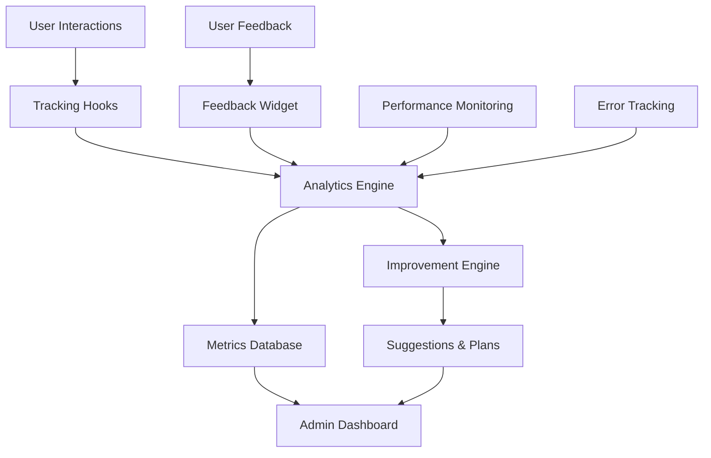

# Chat Enhancements Post-Deployment Guide

## Overview

This guide covers the post-deployment monitoring, analytics, and continuous improvement system for the chat interface enhancements. The system automatically tracks user behavior, collects feedback, monitors performance, and suggests improvements for future iterations.

## Architecture

### Core Components

1. **PostDeploymentAnalytics** - Main analytics engine
2. **ContinuousImprovementEngine** - AI-powered improvement suggestions
3. **PostDeploymentDashboard** - Admin interface for monitoring
4. **FeedbackWidget** - User feedback collection
5. **Tracking Hooks** - React hooks for data collection

### Data Flow



## Key Features

### 1. Adoption Metrics Tracking

Monitors how users adopt and use the new chat features:

- **Markdown Usage**: Tracks adoption rate, complexity, and rendering performance
- **Scroll Behavior**: Monitors manual scrolling, auto-scroll usage, and scroll-back frequency
- **Controls Usage**: Tracks usage of close button, keyboard shortcuts, and other controls

### 2. Performance Monitoring

Continuously monitors system performance:

- **Render Times**: Markdown rendering, scroll response times
- **Memory Usage**: JavaScript heap usage tracking
- **Error Rates**: Automatic error detection and categorization
- **Alert System**: Automatic alerts for performance degradation

### 3. User Feedback Collection

Structured feedback collection system:

- **Rating System**: 1-5 star ratings with contextual feedback
- **Categorization**: Automatic categorization by feature area
- **Priority Assignment**: Automatic priority based on rating and type
- **Feedback Types**: Bug reports, feature requests, improvements, praise, complaints

### 4. Continuous Improvement

AI-powered analysis and suggestions:

- **Pattern Recognition**: Identifies usage patterns and pain points
- **Improvement Suggestions**: Generates actionable improvement recommendations
- **Iteration Planning**: Creates development plans based on data
- **Priority Scoring**: Intelligent prioritization of improvements

## Implementation

### 1. Setting Up Analytics Tracking

```typescript
import { usePostDeploymentTracking } from '@/hooks/usePostDeploymentTracking';

function ChatComponent() {
  const { 
    trackMarkdownUsage, 
    trackScrollBehavior, 
    trackControlsUsage 
  } = usePostDeploymentTracking();

  // Track markdown rendering
  const handleMarkdownRender = (content: string, renderTime: number) => {
    trackMarkdownUsage(content, renderTime);
  };

  // Track scroll events
  const handleScroll = (type: 'manual_scroll' | 'auto_scroll_disabled') => {
    trackScrollBehavior({ type, responseTime: performance.now() });
  };

  // Track control usage
  const handleControlClick = (action: 'close' | 'minimize') => {
    trackControlsUsage(action);
  };

  return (
    // Your chat component JSX
  );
}
```

### 2. Collecting User Feedback

```typescript
import { useFeedbackCollection } from '@/hooks/usePostDeploymentTracking';

function FeedbackButton() {
  const { collectFeedback } = useFeedbackCollection();

  const handleFeedback = async () => {
    await collectFeedback(
      4, // rating
      "Love the new markdown support!", // message
      'markdown', // category
      'praise' // type
    );
  };

  return <button onClick={handleFeedback}>Give Feedback</button>;
}
```

### 3. Admin Dashboard Integration

```typescript
import PostDeploymentDashboard from '@/components/admin/PostDeploymentDashboard';

function AdminPage() {
  return (
    <div>
      <h1>Chat Analytics</h1>
      <PostDeploymentDashboard />
    </div>
  );
}
```

## API Endpoints

### Analytics Data

- `GET /api/admin/post-deployment-analytics?type=metrics` - Get current metrics
- `GET /api/admin/post-deployment-analytics?type=feedback` - Get user feedback
- `GET /api/admin/post-deployment-analytics?type=alerts` - Get performance alerts
- `GET /api/admin/post-deployment-analytics?type=report` - Generate adoption report
- `GET /api/admin/post-deployment-analytics?type=export` - Export all data

### Tracking Events

- `POST /api/admin/post-deployment-analytics` - Submit tracking data

```json
{
  "action": "track_markdown",
  "data": {
    "content": "# Hello World",
    "renderTime": 45
  }
}
```

## Metrics and KPIs

### Adoption Metrics

- **Markdown Adoption Rate**: Percentage of messages using markdown
- **Feature Discovery Rate**: How quickly users find new features
- **Control Usage Rate**: Frequency of control interactions per session

### Performance Metrics

- **Render Time**: Average markdown rendering time (target: <100ms)
- **Scroll Response**: Scroll event response time (target: <16ms)
- **Memory Usage**: JavaScript heap usage (target: <50MB)
- **Error Rate**: Errors per session (target: <5%)

### User Experience Metrics

- **Session Duration**: Average time spent in chat
- **Messages per Session**: User engagement level
- **User Satisfaction**: Average feedback rating
- **Scroll-back Frequency**: Content navigation patterns

## Improvement Process

### 1. Data Collection Phase

- **Duration**: Continuous
- **Metrics**: All user interactions tracked
- **Feedback**: Collected via in-app widget
- **Performance**: Monitored in real-time

### 2. Analysis Phase

- **Frequency**: Weekly automated analysis
- **Pattern Recognition**: AI identifies trends and issues
- **Opportunity Identification**: Suggests improvement areas
- **Priority Scoring**: Ranks suggestions by impact and effort

### 3. Planning Phase

- **Iteration Planning**: Creates development roadmap
- **Resource Allocation**: Considers team capacity
- **Risk Assessment**: Identifies potential issues
- **Success Criteria**: Defines measurable goals

### 4. Implementation Phase

- **Feature Development**: Based on prioritized suggestions
- **A/B Testing**: Compare old vs new implementations
- **Gradual Rollout**: Progressive feature deployment
- **Monitoring**: Track impact of changes

## Alert System

### Performance Alerts

- **Critical**: Render time >200ms, Error rate >10%
- **Warning**: Render time >100ms, Memory usage >50MB
- **Info**: Usage pattern changes, Feature adoption milestones

### User Feedback Alerts

- **Critical**: Multiple 1-2 star ratings, Bug reports
- **High**: Consistent complaints about specific features
- **Medium**: Feature requests with high demand

### System Health Alerts

- **Error Spikes**: Sudden increase in error rates
- **Performance Degradation**: Gradual performance decline
- **Adoption Drops**: Significant decrease in feature usage

## Best Practices

### 1. Data Privacy

- **Anonymization**: No personally identifiable information stored
- **Consent**: Users can opt-out of tracking
- **Retention**: Data automatically purged after 90 days
- **Security**: All data encrypted at rest and in transit

### 2. Performance Impact

- **Batching**: Events batched to reduce network requests
- **Throttling**: Rate limiting to prevent performance impact
- **Async Processing**: Non-blocking data collection
- **Minimal Overhead**: <1ms impact on user interactions

### 3. Actionable Insights

- **Specific Recommendations**: Clear, actionable suggestions
- **Evidence-Based**: All suggestions backed by data
- **Prioritized**: Ranked by impact and feasibility
- **Measurable**: Success criteria defined for each improvement

## Troubleshooting

### Common Issues

1. **Missing Data**
   - Check tracking hook implementation
   - Verify API endpoint connectivity
   - Review browser console for errors

2. **Inaccurate Metrics**
   - Validate tracking event parameters
   - Check for duplicate event firing
   - Review metric calculation logic

3. **Performance Impact**
   - Monitor tracking overhead
   - Adjust batching settings
   - Review event throttling

### Debug Mode

Enable debug logging:

```typescript
const tracking = usePostDeploymentTracking({
  enableAutoTracking: true,
  debug: true // Enable debug logging
});
```

## Future Enhancements

### Planned Features

1. **Predictive Analytics**: ML-powered usage prediction
2. **Real-time Dashboards**: Live metrics visualization
3. **Advanced Segmentation**: User cohort analysis
4. **Automated A/B Testing**: Intelligent feature testing
5. **Integration APIs**: Third-party analytics integration

### Roadmap

- **Q1**: Enhanced feedback collection and analysis
- **Q2**: Predictive analytics and ML insights
- **Q3**: Advanced dashboard features and reporting
- **Q4**: Full automation of improvement cycle

## Support

For questions or issues with the post-deployment system:

1. Check the troubleshooting section above
2. Review the API documentation
3. Contact the development team
4. Submit a GitHub issue with detailed information

## Conclusion

The post-deployment monitoring and continuous improvement system ensures that the chat enhancements continue to evolve based on real user data and feedback. By automatically tracking usage patterns, collecting feedback, and suggesting improvements, the system enables data-driven development and optimal user experience.