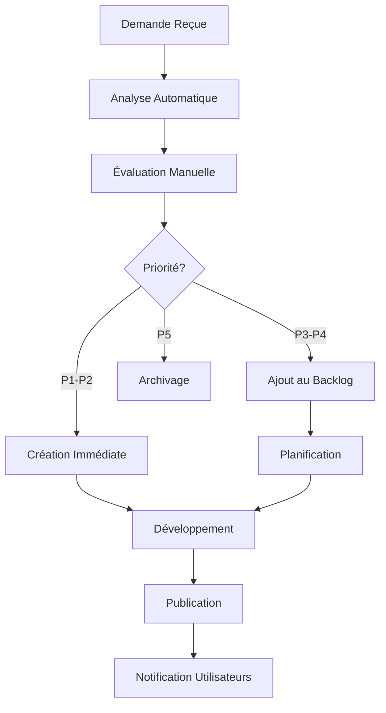

# Gestion des Demandes de Ressources - Guide Complet

## 🎯 Vue d'ensemble

Ce guide détaille le processus complet de gestion des demandes de ressources reçues via le système d'audit des liens morts. Il couvre la réception, l'analyse, la priorisation, le traitement et le suivi des demandes.

## 📧 Réception des Demandes

### 1.1 Format des Emails Reçus

Les demandes arrivent sur `ls@laurentserre.com` avec le format suivant :

```
Sujet: Nouvelle demande de ressource - [NOM_RESSOURCE]

📧 Email du demandeur : user@example.com
📄 Ressource demandée : /ressources/guide-prospection-pme
🌐 Page source : https://laurentserre.com/formation-commerciale-pme
📊 Nombre de demandes : 3 fois ce mois-ci

💬 Message (optionnel) :
"Bonjour, je suis très intéressé par ce guide pour améliorer 
ma prospection en PME. Merci !"

---
Système d'audit automatique - Laurent Serre Développement
```

### 1.2 Fréquence de Réception

- **Temps réel** : Dès qu'un utilisateur fait une demande
- **Volume estimé** : 5-15 demandes par jour
- **Pics** : Après publications blog ou campagnes marketing

### 1.3 Réponse Automatique à l'Utilisateur

L'utilisateur reçoit automatiquement :

```
Sujet: Confirmation de votre demande de ressource

Bonjour,

Nous avons bien reçu votre demande concernant :
[NOM_RESSOURCE]

Notre équipe va examiner votre demande et vous tiendra informé 
de la disponibilité de cette ressource.

En attendant, vous pourriez être intéressé par nos ressources 
déjà disponibles : https://laurentserre.com/ressources

Cordialement,
L'équipe Laurent Serre Développement
```

## 📊 Analyse et Priorisation

### 2.1 Critères de Priorisation

#### Fréquence de Demande (40%)
- **Très haute** : >10 demandes/mois
- **Haute** : 5-10 demandes/mois  
- **Moyenne** : 2-4 demandes/mois
- **Faible** : 1 demande/mois

#### Impact SEO Potentiel (30%)
- **Critique** : Page de service principale
- **Haute** : Page de contenu populaire
- **Moyenne** : Page de ressource spécialisée
- **Faible** : Page secondaire

#### Alignement Stratégique (20%)
- **Parfait** : Correspond aux objectifs business
- **Bon** : Complète l'offre existante
- **Moyen** : Intérêt limité
- **Faible** : Hors stratégie

#### Complexité de Création (10%)
- **Simple** : 1-2 heures (guide court, checklist)
- **Moyenne** : 1-2 jours (guide complet, outil)
- **Complexe** : 1 semaine (formation, système)
- **Très complexe** : >1 semaine (plateforme, cours)

### 2.2 Matrice de Priorisation

| Score Total | Priorité | Délai Cible | Action |
|-------------|----------|-------------|---------|
| 80-100 | P1 - Critique | 1 semaine | Création immédiate |
| 60-79 | P2 - Haute | 1 mois | Planification rapide |
| 40-59 | P3 - Moyenne | 3 mois | Backlog prioritaire |
| 20-39 | P4 - Faible | 6 mois | Backlog standard |
| <20 | P5 - Très faible | Indéfini | Évaluation future |

### 2.3 Outil d'Analyse

#### Dashboard des Demandes

Accessible via : `https://laurentserre.com/admin/resource-requests`

**Métriques Affichées :**
- Nombre total de demandes
- Ressources les plus demandées
- Évolution mensuelle
- Statut de traitement
- Temps de réponse moyen

**Filtres Disponibles :**
- Par période (semaine, mois, trimestre)
- Par statut (nouveau, en cours, terminé)
- Par priorité (P1 à P5)
- Par type de ressource

## 🔄 Processus de Traitement

### 3.1 Workflow Standard



### 3.2 Étapes Détaillées

#### Étape 1 : Réception et Tri (5 min)
1. **Lecture de l'email** de demande
2. **Vérification** de la validité (pas de spam)
3. **Extraction** des informations clés
4. **Enregistrement** dans le système

#### Étape 2 : Analyse Initiale (10 min)
1. **Évaluation** selon les critères de priorisation
2. **Recherche** de ressources similaires existantes
3. **Estimation** de la complexité de création
4. **Attribution** d'un score de priorité

#### Étape 3 : Décision (5 min)
1. **P1-P2** : Création immédiate → Étape 4
2. **P3-P4** : Ajout au backlog → Étape 5
3. **P5** : Archivage avec justification

#### Étape 4 : Création Immédiate (Variable)
1. **Planification** détaillée (30 min)
2. **Création** du contenu (1h à plusieurs jours)
3. **Révision** et validation (30 min)
4. **Publication** et intégration (30 min)
5. **Notification** des demandeurs

#### Étape 5 : Gestion du Backlog
1. **Ajout** à la liste priorisée
2. **Révision** hebdomadaire des priorités
3. **Planification** selon la capacité
4. **Communication** des délais si demandé

### 3.3 Templates de Réponse

#### Accusé de Réception Personnalisé
```
Sujet: Re: Demande de ressource - [NOM_RESSOURCE]

Bonjour [PRÉNOM],

Merci pour votre demande concernant [RESSOURCE_DEMANDÉE].

Après analyse, cette ressource a été classée en priorité [P1/P2/P3] 
et sera disponible d'ici [DÉLAI_ESTIMÉ].

[SI P1-P2]
Nous commençons sa création dès maintenant et vous tiendrons 
informé de l'avancement.

[SI P3-P4]
Cette ressource a été ajoutée à notre backlog prioritaire. 
Nous vous notifierons dès le début de sa création.

En attendant, vous pourriez trouver utiles ces ressources :
- [RESSOURCE_SIMILAIRE_1]
- [RESSOURCE_SIMILAIRE_2]

Cordialement,
Laurent Serre
```

#### Notification de Publication
```
Sujet: 🎉 Votre ressource demandée est disponible !

Bonjour [PRÉNOM],

Excellente nouvelle ! La ressource que vous aviez demandée 
est maintenant disponible :

📄 [NOM_RESSOURCE]
🔗 [LIEN_DIRECT]

Cette ressource a été créée suite à votre demande et celle 
de [NOMBRE] autres utilisateurs.

N'hésitez pas à :
- Télécharger et utiliser cette ressource
- Nous faire part de vos retours
- Partager avec vos collègues si elle vous est utile

Merci de nous avoir fait confiance pour vos besoins en 
développement commercial !

Cordialement,
Laurent Serre
```

## 📈 Suivi et Métriques

### 4.1 KPIs de Performance

#### Métriques de Réactivité
- **Temps de première réponse** : <24h (objectif : <4h)
- **Temps de traitement P1** : <1 semaine
- **Temps de traitement P2** : <1 mois
- **Taux de réponse** : 100%

#### Métriques de Qualité
- **Satisfaction utilisateur** : >4.5/5
- **Taux d'utilisation** des ressources créées : >70%
- **Taux de recommandation** : >80%
- **Nombre de partages** : Mesure de viralité

#### Métriques Business
- **Conversion en leads** : % de demandeurs devenus prospects
- **ROI des ressources** : Valeur générée vs coût de création
- **Impact SEO** : Amélioration du trafic sur les pages concernées

### 4.2 Reporting

#### Rapport Hebdomadaire (Lundi)
```
📊 Rapport Demandes de Ressources - Semaine [DATE]

📈 Nouvelles demandes : [NOMBRE]
✅ Ressources créées : [NOMBRE]
⏳ En cours de création : [NOMBRE]
📋 Backlog total : [NOMBRE]

🏆 Top 3 des demandes :
1. [RESSOURCE_1] - [NOMBRE] demandes
2. [RESSOURCE_2] - [NOMBRE] demandes  
3. [RESSOURCE_3] - [NOMBRE] demandes

⚡ Actions de la semaine :
- [ACTION_1]
- [ACTION_2]
- [ACTION_3]

📅 Planification semaine prochaine :
- [RESSOURCE_À_CRÉER_1]
- [RESSOURCE_À_CRÉER_2]
```

#### Rapport Mensuel (1er du mois)
- Analyse des tendances
- ROI des ressources créées
- Satisfaction utilisateur
- Optimisations du processus

### 4.3 Outils de Suivi

#### Tableau de Bord Temps Réel
- **URL** : `/admin/resource-requests`
- **Mise à jour** : Temps réel
- **Accès** : Administrateurs uniquement

#### Intégration CRM
- **Synchronisation** avec HubSpot
- **Scoring** des leads générés
- **Suivi** du parcours client

## 🔧 Optimisation Continue

### 5.1 Analyse des Patterns

#### Patterns de Demandes Fréquents
- **Guides pratiques** : 40% des demandes
- **Outils/Templates** : 25% des demandes
- **Formations courtes** : 20% des demandes
- **Études de cas** : 15% des demandes

#### Saisonnalité
- **Janvier-Mars** : Pic de demandes (nouveaux objectifs)
- **Septembre-Octobre** : Reprise d'activité
- **Décembre** : Ralentissement

### 5.2 Améliorations du Processus

#### Automatisation
- **Tri automatique** par mots-clés
- **Scoring automatique** basé sur l'historique
- **Suggestions** de ressources similaires
- **Templates** de réponse personnalisés

#### Prédiction
- **Analyse prédictive** des demandes futures
- **Planification proactive** des créations
- **Optimisation** des ressources existantes

### 5.3 Feedback Loop

#### Collecte de Feedback
- **Email de suivi** 1 semaine après publication
- **Enquête de satisfaction** trimestrielle
- **Analyse** des téléchargements et usage

#### Actions d'Amélioration
- **Mise à jour** des ressources existantes
- **Création** de versions améliorées
- **Optimisation** du processus de création

## 📞 Contacts et Responsabilités

### 6.1 Équipe de Gestion

- **Responsable Principal** : Laurent Serre (ls@laurentserre.com)
- **Analyse et Priorisation** : Laurent Serre
- **Création de Contenu** : Laurent Serre + Équipe
- **Support Technique** : Équipe développement

### 6.2 Escalade

#### Niveau 1 : Traitement Standard
- Demandes P3-P5
- Processus automatisé
- Délais standards

#### Niveau 2 : Traitement Prioritaire  
- Demandes P1-P2
- Validation Laurent Serre
- Création accélérée

#### Niveau 3 : Traitement Exceptionnel
- Demandes VIP ou stratégiques
- Décision direction
- Ressources dédiées

---

## 📚 Annexes

### A. Exemples de Ressources par Catégorie

#### Guides Pratiques
- Guide de prospection PME
- Checklist de négociation
- Méthodes de closing
- Techniques d'objection

#### Outils/Templates
- Scripts d'appels
- Templates d'emails
- Grilles d'évaluation
- Calculateurs ROI

#### Formations Courtes
- Modules e-learning
- Webinaires enregistrés
- Vidéos tutoriels
- Podcasts experts

### B. Critères de Qualité

#### Contenu
- **Pertinence** : Répond au besoin exprimé
- **Qualité** : Niveau expert, actionnable
- **Originalité** : Apporte une valeur unique
- **Complétude** : Traite le sujet en profondeur

#### Format
- **Accessibilité** : Facile à télécharger/consulter
- **Design** : Professionnel et cohérent
- **Utilisabilité** : Pratique et applicable
- **Durabilité** : Reste pertinent dans le temps

---

**Document créé le :** 30 juillet 2025  
**Version :** 1.0  
**Responsable :** Laurent Serre (ls@laurentserre.com)  
**Prochaine révision :** 30 octobre 2025