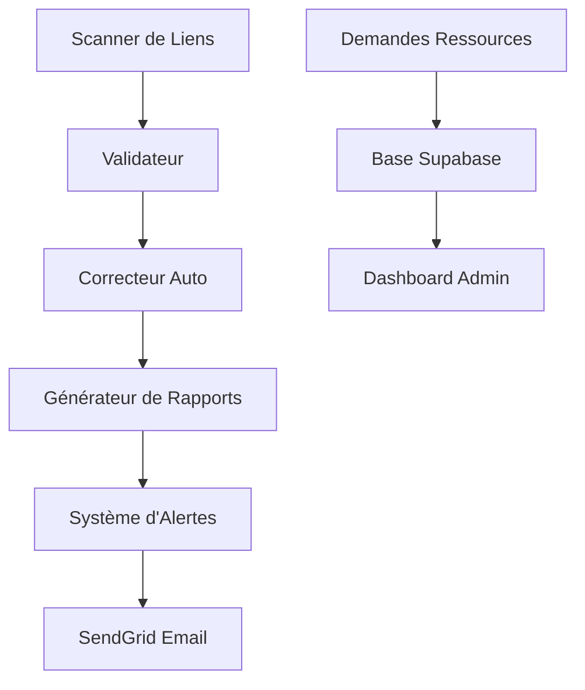

# Guide de Formation - Système d'Audit des Liens

## 🎯 Objectifs de la Formation

Cette formation vous permettra de :
- Comprendre le fonctionnement du système d'audit des liens
- Utiliser efficacement le tableau de bord et les rapports
- Traiter les alertes et demandes de ressources
- Effectuer les tâches de maintenance courantes
- Réagir appropriément aux situations d'urgence

## 📚 Module 1 : Vue d'ensemble du Système

### 1.1 Architecture du Système

Le système d'audit des liens se compose de :



### 1.2 Composants Principaux

1. **Scanner de Liens** : Parcourt tous les fichiers du projet
2. **Validateur** : Teste chaque lien trouvé
3. **Correcteur Automatique** : Corrige les erreurs simples
4. **Générateur de Rapports** : Crée les rapports JSON/HTML/CSV
5. **Système d'Alertes** : Envoie des emails via SendGrid
6. **Dashboard** : Interface de monitoring et gestion

### 1.3 Flux de Données

1. **Scan quotidien** (2h du matin) → Détection des liens
2. **Validation** → Test de chaque lien
3. **Correction automatique** → Réparation des erreurs simples
4. **Génération de rapports** → Création des fichiers de rapport
5. **Analyse des seuils** → Déclenchement d'alertes si nécessaire
6. **Envoi d'emails** → Notification à ls@laurentserre.com

## 🖥️ Module 2 : Utilisation du Dashboard

### 2.1 Accès au Dashboard

**URL :** `https://laurentserre.com/admin/audit-dashboard`

**Authentification :** 
- Accès restreint aux administrateurs
- Utilise l'authentification Supabase

### 2.2 Vue d'ensemble du Dashboard

#### Métriques Principales (en haut)

| Métrique | Description | Valeur Normale | Alerte si |
|----------|-------------|----------------|-----------|
| **Santé des Liens** | Pourcentage de liens valides | >90% | <85% |
| **Liens Morts** | Nombre de liens cassés | <50 | >100 |
| **Demandes Ressources** | Nouvelles demandes ce mois | Variable | Pic soudain |
| **Corrections Auto** | Corrections appliquées | Variable | Échecs répétés |

#### Graphiques et Tableaux

1. **Graphique de Santé des Liens** (LinkHealthChart)
   - Évolution sur 30 jours
   - Tendance générale
   - Points d'alerte

2. **Tableau des Liens Morts** (BrokenLinksTable)
   - Liste des liens cassés
   - Priorité (Critique/Haute/Moyenne/Faible)
   - Actions suggérées

3. **Graphique des Demandes** (ResourceRequestsChart)
   - Évolution des demandes
   - Ressources les plus demandées
   - Statut de traitement

4. **Historique des Audits** (AuditHistoryChart)
   - Performance des audits
   - Temps d'exécution
   - Taux de réussite

### 2.3 Actions Disponibles

#### Boutons d'Action Rapide

- **🔄 Lancer Audit** : Déclenche un audit immédiat
- **📧 Test Email** : Envoie un email de test
- **🧹 Nettoyer** : Supprime les anciennes données
- **📊 Export** : Télécharge les rapports

#### Filtres et Recherche

- **Par priorité** : Critique, Haute, Moyenne, Faible
- **Par type** : Interne, Externe, Téléchargement, Ancre
- **Par statut** : Nouveau, En cours, Résolu
- **Par date** : Dernière semaine, mois, trimestre

## 📊 Module 3 : Lecture et Analyse des Rapports

### 3.1 Types de Rapports

#### Rapport JSON (Technique)
```json
{
  "timestamp": "2025-07-30T09:43:15.727Z",
  "summary": {
    "totalLinks": 498,
    "validLinks": 41,
    "brokenLinks": 442,
    "seoHealthScore": 8
  },
  "brokenLinks": [...],
  "seoImpact": {...}
}
```

#### Rapport HTML (Visuel)
- Interface web interactive
- Graphiques et tableaux
- Filtres et tri
- Export possible

#### Rapport CSV (Analyse)
- Format tableur
- Idéal pour Excel/Google Sheets
- Analyse de données
- Création de graphiques personnalisés

### 3.2 Interprétation des Métriques

#### Score de Santé SEO
- **90-100%** : Excellent ✅
- **80-89%** : Bon ⚠️
- **70-79%** : Moyen ⚠️
- **<70%** : Critique ❌

#### Priorités des Liens Morts

1. **Critique** : Pages principales, liens de navigation
2. **Haute** : Pages de contenu, ressources importantes
3. **Moyenne** : Liens secondaires, références
4. **Faible** : Liens optionnels, archives

#### Impact SEO

- **Trafic estimé perdu** : Basé sur l'importance des pages
- **Pages affectées** : Nombre de pages avec liens morts
- **Score de risque** : Évaluation globale du risque SEO

### 3.3 Actions Recommandées par Rapport

Chaque rapport contient des recommandations automatiques :

```
📋 Recommandations:
1. Corriger 15 liens critiques en priorité
2. Créer la ressource "/guide-prospection" (demandée 8 fois)
3. Vérifier les redirections sur les pages de service
4. Optimiser les liens internes vers les pages de conversion
```

## 📧 Module 4 : Gestion des Alertes Email

### 4.1 Types d'Alertes Reçues

#### Alerte Quotidienne (si problème)
```
Sujet: 🚨 Alerte : Liens morts détectés
Contenu:
- Nombre de liens morts détectés
- Score de santé actuel
- Liens critiques à corriger
- Lien vers le rapport complet
```

#### Rapport Hebdomadaire (tous les lundis 9h)
```
Sujet: 📊 Rapport hebdomadaire - Audit des liens
Contenu:
- Résumé de la semaine
- Évolution des métriques
- Nouvelles demandes de ressources
- Actions recommandées
```

#### Demande de Ressource (temps réel)
```
Sujet: 📄 Nouvelle demande de ressource - [NOM_RESSOURCE]
Contenu:
- Email du demandeur
- Ressource demandée
- Page source
- Message optionnel
- Nombre total de demandes pour cette ressource
```

### 4.2 Traitement des Alertes

#### Processus Standard

1. **Réception** : Email arrive sur ls@laurentserre.com
2. **Évaluation** : Analyser la criticité
3. **Priorisation** : Classer par urgence
4. **Action** : Corriger ou planifier
5. **Suivi** : Vérifier la résolution

#### Matrice de Priorité

| Type | Urgence | Délai de Traitement |
|------|---------|-------------------|
| Liens critiques cassés | Immédiate | 2h |
| Dégradation score SEO | Haute | 24h |
| Demande ressource populaire | Moyenne | 1 semaine |
| Liens secondaires | Faible | 1 mois |

### 4.3 Réponses Types

#### Accusé de Réception (Demande Ressource)
```
Bonjour,

Merci pour votre demande concernant [RESSOURCE].
Nous avons bien pris note de votre intérêt.

Cette ressource est actuellement en développement et sera 
disponible d'ici [DÉLAI ESTIMÉ].

Nous vous notifierons dès sa publication.

Cordialement,
L'équipe Laurent Serre Développement
```

#### Notification de Résolution
```
Bonjour,

La ressource que vous aviez demandée est maintenant disponible :
[LIEN VERS LA RESSOURCE]

N'hésitez pas à nous faire part de vos retours.

Cordialement,
L'équipe Laurent Serre Développement
```

## 🔧 Module 5 : Tâches de Maintenance

### 5.1 Maintenance Quotidienne (15 min)

#### Checklist Matin (9h00)
- [ ] Vérifier les emails d'alerte
- [ ] Consulter le dashboard
- [ ] Traiter les demandes urgentes
- [ ] Vérifier l'exécution du cron nocturne

#### Actions Courantes
```bash
# Vérifier le statut du système
npm run audit:status

# Lancer un audit manuel si nécessaire
npm run audit:full

# Voir les corrections disponibles
npm run audit:fix --dry-run
```

### 5.2 Maintenance Hebdomadaire (30 min)

#### Lundi Matin - Analyse du Rapport
1. Lire le rapport hebdomadaire reçu par email
2. Analyser les tendances
3. Planifier les corrections de la semaine
4. Prioriser les demandes de ressources

#### Mercredi - Maintenance Préventive
```bash
# Nettoyer les anciennes données
npm run audit:maintenance cleanup

# Optimiser la base de données
npm run audit:maintenance optimize

# Vérifier les performances
npm run test:audit:performance
```

### 5.3 Maintenance Mensuelle (2h)

#### Révision Complète
1. **Analyse des métriques** sur 30 jours
2. **Optimisation** des configurations
3. **Mise à jour** de la documentation
4. **Formation** de l'équipe si nécessaire

#### Tâches Techniques
- Mise à jour des dépendances
- Révision des seuils d'alerte
- Optimisation des performances
- Sauvegarde et test de restauration

## 🚨 Module 6 : Gestion des Urgences

### 6.1 Identification des Urgences

#### Signaux d'Alerte
- Score de santé < 60%
- Plus de 200 liens morts soudainement
- Aucun email reçu depuis 24h
- Dashboard inaccessible
- Erreurs 500 répétées

#### Niveaux d'Urgence

**🔴 Critique** : Système hors service
- Action : Immédiate (dans l'heure)
- Escalade : Support technique

**🟠 Majeur** : Dégradation importante
- Action : Rapide (dans la journée)
- Escalade : Équipe interne

**🟡 Mineur** : Problème localisé
- Action : Planifiée (dans la semaine)
- Escalade : Aucune

### 6.2 Procédures d'Urgence

#### Panne Système Complète

1. **Diagnostic** (5 min)
   ```bash
   # Tester les endpoints
   curl https://laurentserre.com/api/audit-links
   
   # Vérifier les services
   # - Vercel : status.vercel.com
   # - Supabase : status.supabase.com
   # - SendGrid : status.sendgrid.com
   ```

2. **Actions Correctives** (15 min)
   - Redéployer si nécessaire
   - Vérifier les variables d'environnement
   - Tester les connexions aux services

3. **Communication** (10 min)
   - Informer l'équipe
   - Documenter l'incident
   - Planifier le suivi

#### Pic de Liens Morts

1. **Analyse Rapide**
   - Identifier la cause (déploiement récent ?)
   - Évaluer l'impact SEO
   - Prioriser les corrections

2. **Corrections d'Urgence**
   ```bash
   # Corrections automatiques haute confiance
   npm run audit:fix --confidence=0.9
   
   # Identifier les corrections manuelles
   npm run audit:status --priority=critical
   ```

3. **Suivi**
   - Surveiller l'évolution
   - Communiquer les délais
   - Valider les corrections

## 📞 Module 7 : Contacts et Escalade

### 7.1 Contacts Techniques

- **Laurent Serre** : ls@laurentserre.com
- **Support Vercel** : support@vercel.com
- **Support Supabase** : support@supabase.com
- **Support SendGrid** : support@sendgrid.com

### 7.2 Procédure d'Escalade

1. **Niveau 1** : Résolution interne (1h)
2. **Niveau 2** : Contact support fournisseur (4h)
3. **Niveau 3** : Escalade direction (24h)

### 7.3 Information à Fournir

Lors d'un contact support, préparer :
- Description du problème
- Heure de début
- Actions déjà tentées
- Logs d'erreur
- Impact estimé

## ✅ Module 8 : Évaluation et Certification

### 8.1 Quiz de Validation

#### Questions Théoriques
1. Quels sont les 4 types de liens détectés par le scanner ?
2. À quelle fréquence s'exécute l'audit automatique ?
3. Quel est le seuil d'alerte pour le score de santé SEO ?
4. Combien de temps garder les données d'audit ?

#### Questions Pratiques
1. Comment lancer un audit manuel ?
2. Où trouver les rapports générés ?
3. Comment traiter une demande de ressource ?
4. Que faire si le score de santé chute à 70% ?

### 8.2 Exercices Pratiques

#### Exercice 1 : Navigation Dashboard
- Accéder au dashboard
- Identifier les métriques principales
- Filtrer les liens par priorité
- Exporter un rapport CSV

#### Exercice 2 : Traitement d'Alerte
- Simuler une alerte de liens morts
- Analyser le rapport
- Proposer un plan d'action
- Documenter les étapes

#### Exercice 3 : Maintenance Préventive
- Lancer un audit complet
- Nettoyer les anciennes données
- Vérifier les performances
- Mettre à jour la documentation

### 8.3 Certification

**Critères de Réussite :**
- Quiz théorique : 80% minimum
- Exercices pratiques : Tous réalisés
- Démonstration autonome des tâches courantes

**Validité :** 6 mois (recyclage recommandé)

---

## 📚 Ressources Complémentaires

- [Procédures de Maintenance](./MAINTENANCE_PROCEDURES.md)
- [Guide Technique](./AUDIT_SYSTEM_TECHNICAL_GUIDE.md)
- [Guide de Dépannage](./AUDIT_SYSTEM_TROUBLESHOOTING_GUIDE.md)
- [FAQ](./AUDIT_SYSTEM_FAQ.md)

---

**Formation créée le :** 30 juillet 2025  
**Formateur :** Laurent Serre  
**Durée estimée :** 4 heures  
**Niveau :** Intermédiaire