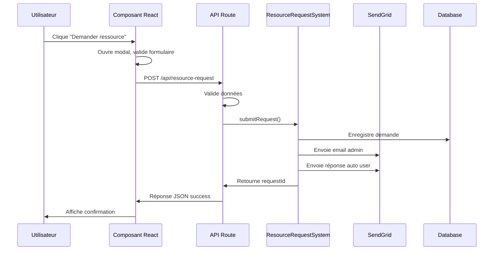

# Documentation - Système de Demande de Ressources

## Vue d'ensemble

Le système de demande de ressources permet aux utilisateurs de demander des ressources qui ne sont pas encore disponibles sur le site. Il comprend plusieurs composants React, une API route, et une intégration complète avec SendGrid pour les notifications email.

## Architecture

```
┌─────────────────────────────────────────────────────────────┐
│                    Frontend Components                      │
├─────────────────────────────────────────────────────────────┤
│ • ResourceRequestModal    - Modal de demande principal      │
│ • MissingResourceCard     - Carte pour ressource manquante  │
│ • MissingResourceBanner   - Bannière compacte              │
│ • useResourceRequest      - Hook de gestion d'état         │
└─────────────────────────────────────────────────────────────┘
                                │
                                ▼
┌─────────────────────────────────────────────────────────────┐
│                      API Layer                             │
├─────────────────────────────────────────────────────────────┤
│ • /api/resource-request   - Endpoint REST                  │
│   - POST: Créer une demande                                │
│   - GET: Statistiques (admin)                              │
└─────────────────────────────────────────────────────────────┘
                                │
                                ▼
┌─────────────────────────────────────────────────────────────┐
│                    Backend Services                        │
├─────────────────────────────────────────────────────────────┤
│ • ResourceRequestSystem   - Logique métier                 │
│ • SendGridEmailService    - Envoi d'emails                 │
│ • Supabase Database       - Stockage des demandes          │
└─────────────────────────────────────────────────────────────┘
```

## Composants

### 1. ResourceRequestModal

Modal principal pour soumettre une demande de ressource.

**Props:**
```typescript
interface ResourceRequestModalProps {
  isOpen: boolean;
  onClose: () => void;
  resourceUrl: string;
  sourceUrl: string;
  resourceTitle?: string;
  resourceDescription?: string;
}
```

**Fonctionnalités:**
- Formulaire avec validation email
- Gestion des états de chargement
- Messages d'erreur et de succès
- Accessibilité complète (ARIA, clavier)
- Support du mode sombre
- Auto-fermeture après succès

**Utilisation:**
```tsx
import ResourceRequestModal from '@/components/ui/ResourceRequestModal';

function MyComponent() {
  const [isModalOpen, setIsModalOpen] = useState(false);

  return (
    <>
      <button onClick={() => setIsModalOpen(true)}>
        Demander la ressource
      </button>
      
      <ResourceRequestModal
        isOpen={isModalOpen}
        onClose={() => setIsModalOpen(false)}
        resourceUrl="/ressources/guide-prospection.pdf"
        sourceUrl={window.location.href}
        resourceTitle="Guide de Prospection"
        resourceDescription="Guide complet sur les techniques de prospection B2B"
      />
    </>
  );
}
```

### 2. MissingResourceCard

Carte complète pour afficher une ressource manquante avec toutes les informations.

**Props:**
```typescript
interface MissingResourceCardProps {
  resourceUrl: string;
  resourceTitle: string;
  resourceDescription?: string;
  expectedAvailability?: string;
  category?: string;
  sourceUrl?: string;
  className?: string;
}
```

**Utilisation:**
```tsx
import MissingResourceCard from '@/components/ui/MissingResourceCard';

<MissingResourceCard
  resourceUrl="/ressources/formation-complete.pdf"
  resourceTitle="Formation Commerciale Complète"
  resourceDescription="Manuel de 200 pages couvrant tous les aspects du développement commercial"
  category="Formation"
  expectedAvailability="Mars 2025"
/>
```

### 3. MissingResourceBanner

Bannière compacte pour signaler une ressource manquante.

**Props:**
```typescript
interface MissingResourceBannerProps {
  resourceUrl: string;
  resourceTitle: string;
  message?: string;
  isDismissible?: boolean;
  variant?: 'warning' | 'info' | 'minimal';
  className?: string;
}
```

**Variantes:**
- `warning`: Orange, pour les ressources importantes
- `info`: Bleu, pour les informations générales
- `minimal`: Gris, pour un style discret

**Utilisation:**
```tsx
import MissingResourceBanner from '@/components/ui/MissingResourceBanner';

<MissingResourceBanner
  resourceUrl="/ressources/guide-prospection.pdf"
  resourceTitle="Guide de Prospection Avancée"
  message="Ce guide est en cours de finalisation."
  variant="warning"
  isDismissible={true}
/>
```

### 4. useResourceRequest Hook

Hook pour gérer l'état des demandes de ressources.

**Interface:**
```typescript
interface UseResourceRequestResult {
  isSubmitting: boolean;
  error: string | null;
  success: boolean;
  submitRequest: (data: ResourceRequestData) => Promise<boolean>;
  reset: () => void;
}
```

**Utilisation:**
```tsx
import { useResourceRequest } from '@/hooks/useResourceRequest';

function MyComponent() {
  const { isSubmitting, error, success, submitRequest, reset } = useResourceRequest();

  const handleSubmit = async () => {
    const success = await submitRequest({
      userEmail: 'user@example.com',
      resourceUrl: '/ressources/guide.pdf',
      sourceUrl: window.location.href,
      message: 'Message optionnel'
    });

    if (success) {
      console.log('Demande envoyée avec succès');
    }
  };

  return (
    <div>
      {error && <div className="error">{error}</div>}
      {success && <div className="success">Demande envoyée !</div>}
      <button onClick={handleSubmit} disabled={isSubmitting}>
        {isSubmitting ? 'Envoi...' : 'Envoyer'}
      </button>
    </div>
  );
}
```

## API Route

### POST /api/resource-request

Crée une nouvelle demande de ressource.

**Body:**
```typescript
{
  userEmail: string;      // Email de l'utilisateur (requis)
  resourceUrl: string;    // URL de la ressource demandée (requis)
  sourceUrl: string;      // URL de la page source (requis)
  message?: string;       // Message optionnel (max 500 caractères)
}
```

**Réponses:**
- `200`: Demande créée avec succès
- `400`: Données invalides
- `429`: Limite quotidienne atteinte
- `500`: Erreur serveur
- `503`: Service indisponible

**Exemple:**
```javascript
const response = await fetch('/api/resource-request', {
  method: 'POST',
  headers: {
    'Content-Type': 'application/json',
  },
  body: JSON.stringify({
    userEmail: 'user@example.com',
    resourceUrl: '/ressources/guide-prospection.pdf',
    sourceUrl: 'https://laurentserre.com/ressources',
    message: 'J\'aimerais avoir accès à ce guide'
  }),
});

const result = await response.json();
```

### GET /api/resource-request

Récupère les statistiques des demandes (nécessite authentification).

**Headers:**
```
Authorization: Bearer <token>
```

**Réponse:**
```typescript
{
  success: true,
  stats: {
    total: number;
    pending: number;
    inProgress: number;
    completed: number;
    rejected: number;
    mostRequested: Array<{ url: string; count: number }>;
  }
}
```

## Flux de Données

### 1. Soumission d'une demande



### 2. Traitement des emails

**Email à l'administrateur (ls@laurentserre.com):**
- Sujet: "🚨 Nouvelle demande de ressource - [URL]"
- Contient: email utilisateur, ressource, page source, message, compteur
- Template HTML avec design professionnel

**Réponse automatique à l'utilisateur:**
- Sujet: "✅ Confirmation de votre demande de ressource"
- Contient: confirmation, liens vers ressources existantes
- Notification automatique lors de disponibilité

## Configuration

### Variables d'environnement

```bash
# SendGrid
SENDGRID_API_KEY=SG.xxx
SENDGRID_FROM_EMAIL=ls@laurentserre.com
SENDGRID_FROM_NAME=Système Audit - Laurent Serre
ADMIN_EMAIL=ls@laurentserre.com

# Supabase
NEXT_PUBLIC_SUPABASE_URL=https://xxx.supabase.co
SUPABASE_SERVICE_ROLE_KEY=xxx

# Limites
AUDIT_MAX_REQUESTS_PER_DAY=100
AUDIT_ENABLE_AUTO_RESPONSE=true
```

### Base de données

Table `resource_requests`:
```sql
CREATE TABLE resource_requests (
  id BIGINT GENERATED ALWAYS AS IDENTITY PRIMARY KEY,
  requested_url TEXT NOT NULL,
  user_email TEXT NOT NULL,
  message TEXT,
  source_url TEXT NOT NULL,
  status TEXT DEFAULT 'pending' CHECK (status IN ('pending', 'in_progress', 'completed', 'rejected')),
  priority INTEGER DEFAULT 1,
  request_count INTEGER DEFAULT 1,
  created_at TIMESTAMPTZ DEFAULT NOW(),
  updated_at TIMESTAMPTZ DEFAULT NOW()
);
```

## Sécurité

### Validation des données
- Email: regex validation
- URLs: format validation
- Message: longueur limitée (500 caractères)
- Rate limiting: 100 demandes/jour/utilisateur

### Protection contre le spam
- Limite quotidienne par email
- Validation côté serveur
- Sanitisation des données
- Logs détaillés pour monitoring

### Authentification API
- GET endpoint protégé par token
- POST endpoint public mais rate-limité
- Validation stricte des données

## Monitoring et Analytics

### Métriques disponibles
- Nombre total de demandes
- Demandes par statut
- Ressources les plus demandées
- Taux de conversion email

### Logs
- Toutes les demandes sont loggées
- Erreurs d'envoi email trackées
- Rate limiting events enregistrés

## Tests

### Test des composants
```bash
npx tsx scripts/test-resource-components-simple.ts
```

### Test du système complet
```bash
npx tsx scripts/test-resource-request-component.ts
```

### Page de démonstration
Visitez `/test-resource-request` pour voir tous les composants en action.

## Maintenance

### Nettoyage automatique
- Suppression des demandes > 30 jours
- Archivage des demandes complétées
- Optimisation des index de base de données

### Mise à jour des templates
Les templates email sont dans `src/lib/email/templates/`:
- `resource-request.html`: Email admin
- `auto-response.html`: Réponse utilisateur
- `audit-alert.html`: Alertes système

## Roadmap

### Fonctionnalités futures
- [ ] Interface d'administration web
- [ ] Notifications push
- [ ] Intégration calendrier pour planification
- [ ] Analytics avancées
- [ ] Export des données
- [ ] API webhooks pour intégrations tierces

### Améliorations prévues
- [ ] Catégorisation automatique des demandes
- [ ] Priorisation basée sur l'IA
- [ ] Templates email personnalisables
- [ ] Multi-langue
- [ ] Intégration CRM