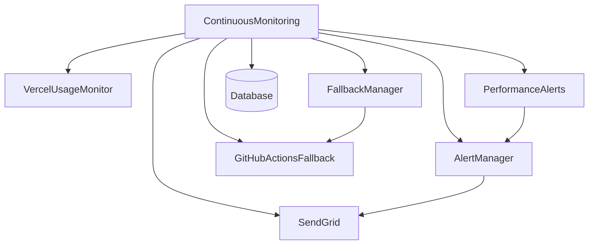

# Documentation du Système de Monitoring Continu

## Vue d'ensemble

Le système de monitoring continu est conçu pour surveiller 24/7 l'optimisation Vercel et assurer la continuité de service du système d'audit des liens morts. Il implémente la **tâche 14** de la spécification d'optimisation Vercel.

## Fonctionnalités Principales

### 1. 🚨 Alertes Automatiques pour Tous les Seuils Critiques

Le système surveille automatiquement :

- **Usage Vercel** : Alertes à 70%, 80%, 90% des limites
- **Performance** : Temps de réponse > 5s, taux d'erreur > 5%
- **Mémoire** : Usage > 400MB par fonction
- **Base de données** : Statut inaccessible ou lent
- **Système de fallback** : Activation automatique détectée

#### Configuration des Alertes

```typescript
const alertRules = [
  {
    id: 'vercel_usage_warning',
    name: 'Usage Vercel - Seuil d\'Avertissement',
    condition: (metrics) => metrics.vercelUsage.percentageUsed >= 70,
    severity: 'warning',
    cooldownMinutes: 60
  },
  {
    id: 'vercel_usage_critical',
    name: 'Usage Vercel - Seuil Critique',
    condition: (metrics) => metrics.vercelUsage.percentageUsed >= 90,
    severity: 'critical',
    cooldownMinutes: 15
  }
  // ... autres règles
];
```

### 2. 📊 Reporting Automatique des Métriques d'Usage

#### Rapports Programmés

- **Quotidien** : Chaque jour à 9h00
- **Hebdomadaire** : Lundi à 10h00
- **Mensuel** : 1er du mois à 11h00

#### Contenu des Rapports

```typescript
interface ReportData {
  period: string;
  averageUsage: number;
  maxUsage: number;
  averageResponseTime: number;
  totalAlerts: number;
  systemStatus: 'healthy' | 'warning' | 'critical';
  fallbackActivations: number;
  recommendations: string[];
}
```

### 3. 📈 Dashboards de Suivi pour l'Équipe Technique

#### Dashboard Principal

Le dashboard `ContinuousMonitoringDashboard` fournit :

- **Vue d'ensemble** : Statut global du système
- **Métriques temps réel** : Usage Vercel, performance, santé
- **Configuration des alertes** : Gestion des règles d'alerte
- **Monitoring des fallbacks** : Statut GitHub Actions
- **Rapports** : Configuration et historique

#### API de Monitoring

```typescript
// Récupérer le statut
GET /api/admin/continuous-monitoring?action=status

// Démarrer/arrêter le monitoring
POST /api/admin/continuous-monitoring
{
  "action": "start" | "stop" | "force-check"
}

// Mettre à jour la configuration
PUT /api/admin/continuous-monitoring
{
  "type": "alert-rule",
  "ruleId": "vercel_usage_warning",
  "updates": { "enabled": false }
}
```

### 4. 🔄 Monitoring de la Santé des Fallbacks GitHub Actions

#### Surveillance des Workflows

Le système surveille automatiquement :

- **Disponibilité** des workflows de fallback
- **Taux de succès** des exécutions récentes
- **Temps de réponse** des activations
- **Logs d'erreur** et diagnostics

#### Workflows Surveillés

1. **fallback-urgent-alerts.yml** : Alertes urgentes (6h)
2. **fallback-health-monitoring.yml** : Monitoring santé (1h)
3. **fallback-emergency-maintenance.yml** : Maintenance d'urgence

## Architecture Technique

### Composants Principaux



### Flux de Monitoring

1. **Collection des métriques** (toutes les 5 minutes)
2. **Évaluation des règles d'alerte**
3. **Vérification de la santé des fallbacks**
4. **Génération des rapports programmés**
5. **Sauvegarde en base de données**

### Base de Données

#### Tables Principales

```sql
-- Métriques de monitoring
CREATE TABLE monitoring_metrics (
    id BIGSERIAL PRIMARY KEY,
    timestamp TIMESTAMPTZ NOT NULL,
    vercel_invocations INTEGER,
    vercel_compute_hours DECIMAL(10,3),
    vercel_percentage_used DECIMAL(5,2),
    average_response_time INTEGER,
    error_rate DECIMAL(5,2),
    memory_usage INTEGER,
    vercel_status VARCHAR(20),
    database_status VARCHAR(20),
    fallback_status VARCHAR(20)
);

-- Logs d'alertes
CREATE TABLE monitoring_alerts (
    id BIGSERIAL PRIMARY KEY,
    alert_id VARCHAR(100),
    alert_name VARCHAR(255),
    severity VARCHAR(20),
    message TEXT,
    triggered_at TIMESTAMPTZ,
    resolved_at TIMESTAMPTZ
);

-- Logs de fallback
CREATE TABLE fallback_logs (
    id BIGSERIAL PRIMARY KEY,
    activated_at TIMESTAMPTZ,
    fallback_type VARCHAR(50),
    trigger_reason TEXT,
    github_run_id BIGINT,
    status VARCHAR(20)
);
```

## Configuration et Déploiement

### Variables d'Environnement

```bash
# Vercel API (pour monitoring usage)
VERCEL_TOKEN=your_vercel_token
VERCEL_TEAM_ID=your_team_id

# GitHub Actions (pour fallbacks)
GITHUB_TOKEN=your_github_token
GITHUB_REPOSITORY=owner/repo

# Base de données
NEXT_PUBLIC_SUPABASE_URL=your_supabase_url
SUPABASE_SERVICE_ROLE_KEY=your_service_role_key

# Alertes
ADMIN_EMAIL=admin@example.com
SENDGRID_API_KEY=your_sendgrid_key
```

### Initialisation de la Base de Données

```bash
# Exécuter le script de setup
psql -f scripts/setup-continuous-monitoring-db.sql
```

### Démarrage du Monitoring

```typescript
import { continuousMonitoring } from '@/lib/monitoring/continuous-monitoring';

// Démarrer le monitoring
await continuousMonitoring.start();

// Configuration personnalisée
const monitoring = new ContinuousMonitoring({
  checkInterval: 5 * 60 * 1000, // 5 minutes
  usageThresholds: {
    warning: 70,
    error: 80,
    critical: 90
  },
  alerting: {
    enabled: true,
    cooldownMinutes: 30,
    adminEmail: 'admin@example.com'
  }
});
```

## Utilisation

### Interface d'Administration

1. **Accéder au dashboard** : `/admin/continuous-monitoring`
2. **Démarrer le monitoring** : Cliquer sur "Démarrer"
3. **Configurer les alertes** : Onglet "Alertes"
4. **Surveiller les fallbacks** : Onglet "Fallbacks"
5. **Consulter les rapports** : Onglet "Rapports"

### API REST

#### Récupérer le Statut

```bash
curl -X GET "/api/admin/continuous-monitoring?action=status"
```

#### Démarrer le Monitoring

```bash
curl -X POST "/api/admin/continuous-monitoring" \
  -H "Content-Type: application/json" \
  -d '{"action": "start"}'
```

#### Forcer une Vérification

```bash
curl -X POST "/api/admin/continuous-monitoring" \
  -H "Content-Type: application/json" \
  -d '{"action": "force-check"}'
```

#### Mettre à Jour une Règle d'Alerte

```bash
curl -X PUT "/api/admin/continuous-monitoring" \
  -H "Content-Type: application/json" \
  -d '{
    "type": "alert-rule",
    "ruleId": "vercel_usage_warning",
    "updates": {"enabled": false}
  }'
```

### Programmation

#### Utilisation Basique

```typescript
import { continuousMonitoring } from '@/lib/monitoring/continuous-monitoring';

// Démarrer le monitoring
await continuousMonitoring.start();

// Récupérer les métriques actuelles
const metrics = continuousMonitoring.getCurrentMetrics();

// Récupérer l'historique
const history = continuousMonitoring.getMetricsHistory(24); // 24 heures

// Forcer une vérification
await continuousMonitoring.forceMonitoringCycle();

// Arrêter le monitoring
continuousMonitoring.stop();
```

#### Gestion des Alertes

```typescript
// Ajouter une règle d'alerte personnalisée
continuousMonitoring.addAlertRule({
  id: 'custom_rule',
  name: 'Règle Personnalisée',
  condition: (metrics) => metrics.vercelUsage.invocations > 50000,
  severity: 'warning',
  message: (metrics) => `Trop d'invocations: ${metrics.vercelUsage.invocations}`,
  cooldownMinutes: 30,
  enabled: true
});

// Mettre à jour une règle
continuousMonitoring.updateAlertRule('custom_rule', {
  enabled: false
});

// Supprimer une règle
continuousMonitoring.removeAlertRule('custom_rule');
```

## Tests et Validation

### Script de Test

```bash
# Exécuter tous les tests
npm run test:continuous-monitoring

# Ou directement
tsx scripts/test-continuous-monitoring.ts
```

### Tests Inclus

1. **Démarrage/arrêt du monitoring**
2. **Collection des métriques**
3. **Règles d'alerte**
4. **Vercel Usage Monitor**
5. **Fallback Manager**
6. **GitHub Actions Fallback**
7. **Intégration base de données**
8. **Génération de rapports**
9. **Déclenchement d'alertes**
10. **Performance sous charge**

### Validation Manuelle

```typescript
// Tester une alerte
await fetch('/api/admin/continuous-monitoring', {
  method: 'POST',
  headers: { 'Content-Type': 'application/json' },
  body: JSON.stringify({
    action: 'test-alert',
    ruleId: 'vercel_usage_warning'
  })
});

// Vérifier la santé du système
const response = await fetch('/api/admin/continuous-monitoring?action=health');
const health = await response.json();
```

## Maintenance et Troubleshooting

### Logs et Diagnostics

Le système génère des logs détaillés :

```typescript
// Activer les logs détaillés
console.log('🔍 Début du cycle de monitoring...');
console.log('📊 Collecte des métriques...');
console.log('🚨 Règle d\'alerte déclenchée: Usage Vercel');
console.log('✅ Cycle de monitoring terminé');
```

### Problèmes Courants

#### 1. Monitoring ne démarre pas

**Cause** : Configuration manquante ou base de données inaccessible

**Solution** :
```bash
# Vérifier les variables d'environnement
echo $NEXT_PUBLIC_SUPABASE_URL
echo $VERCEL_TOKEN

# Tester la connexion à la base
tsx scripts/test-continuous-monitoring.ts
```

#### 2. Alertes non envoyées

**Cause** : SendGrid non configuré ou cooldown actif

**Solution** :
```typescript
// Vérifier la configuration SendGrid
const alertManager = new AlertManager();
await alertManager.testAlerts();

// Vérifier les cooldowns
const rules = continuousMonitoring.getAlertRules();
console.log(rules.map(r => ({ id: r.id, lastTriggered: r.lastTriggered })));
```

#### 3. Fallbacks non fonctionnels

**Cause** : GitHub Actions non configuré

**Solution** :
```bash
# Vérifier la configuration GitHub
echo $GITHUB_TOKEN
echo $GITHUB_REPOSITORY

# Tester les workflows
tsx scripts/test-github-actions-fallback.ts
```

### Nettoyage des Données

```sql
-- Nettoyer les anciennes métriques (>30 jours)
SELECT cleanup_monitoring_data(30);

-- Nettoyer manuellement
DELETE FROM monitoring_metrics 
WHERE timestamp < NOW() - INTERVAL '30 days';
```

### Optimisation des Performances

1. **Index de base de données** : Créés automatiquement
2. **Rétention des données** : 30 jours par défaut
3. **Intervalle de monitoring** : 5 minutes (configurable)
4. **Cooldown des alertes** : 15-60 minutes selon la sévérité

## Métriques de Succès

### Objectifs Quantifiables

- **Disponibilité** : >99.5% uptime du monitoring
- **Latence** : <5s par cycle de monitoring
- **Précision** : <5% de faux positifs d'alertes
- **Couverture** : 100% des seuils critiques surveillés

### KPIs de Monitoring

- **MTTR** (Mean Time To Recovery) : <15 minutes
- **MTTD** (Mean Time To Detection) : <5 minutes
- **Taux de disponibilité** des fallbacks : >99%
- **Précision des prédictions** d'usage : >90%

## Évolutions Futures

### Améliorations Prévues

1. **Machine Learning** : Prédiction intelligente des pannes
2. **Intégrations** : Slack, Discord, PagerDuty
3. **Dashboards avancés** : Graphiques temps réel
4. **Auto-scaling** : Ajustement automatique des ressources
5. **Corrélation d'événements** : Analyse des causes racines

### Extensibilité

Le système est conçu pour être facilement extensible :

```typescript
// Ajouter un nouveau type de métrique
interface CustomMetrics extends MonitoringMetrics {
  customField: number;
}

// Ajouter un nouveau type d'alerte
class CustomAlertRule implements AlertRule {
  // Implementation
}

// Ajouter un nouveau système de fallback
class CustomFallback {
  // Implementation
}
```

---

**Note** : Cette documentation est maintenue à jour avec chaque version du système. Pour les dernières informations, consultez le code source et les tests associés.