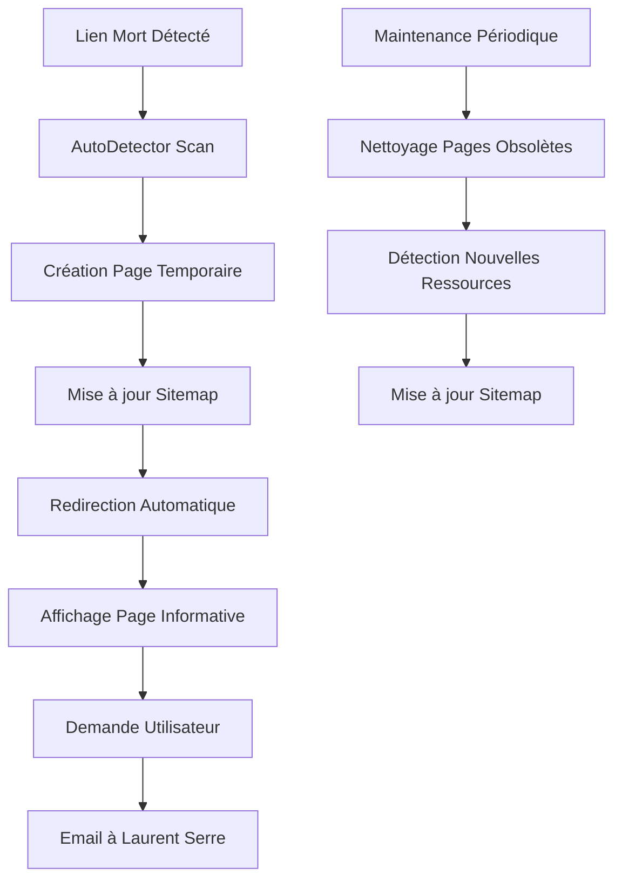

# Implémentation du Système de Pages Temporaires - Résumé

## ✅ Tâche 8 Complétée : Développer les pages temporaires pour ressources manquantes

### 🎯 Objectifs Atteints

Le système de pages temporaires a été entièrement implémenté selon les spécifications des requirements 5.2, 5.3, et 5.4. Il permet de :

- **Remplacer les erreurs 404** par des pages informatives et professionnelles
- **Maintenir l'expérience utilisateur** avec des messages clairs sur l'état de développement
- **Collecter les demandes** des utilisateurs pour prioriser le développement
- **Automatiser la gestion** des ressources manquantes

## 🏗️ Composants Implémentés

### 8.1 Composants de Pages Temporaires ✅

#### 1. **TemporaryResourcePage.tsx**
- Page temporaire complète avec design professionnel
- Support de 6 types de ressources (download, page, guide, tool, template, other)
- Affichage du statut de développement et progression
- Intégration du système de demande de ressource
- Alternatives suggérées et informations contextuelles

#### 2. **MissingResourceHandler.tsx**
- Gestionnaire flexible pour différents contextes d'affichage
- Modes : page complète, inline, modal
- Détection automatique du type de ressource
- Hook `useMissingResourceDetection` pour la détection en temps réel
- Composant `SafeResourceLink` pour les liens sécurisés

#### 3. **Page Next.js Temporaire**
- Route `/temporary-resource/page.tsx` pour l'affichage des pages temporaires
- Support des paramètres URL pour la personnalisation
- Métadonnées SEO appropriées (noindex pour éviter l'indexation)
- Intégration avec le système de navigation

### 8.2 Génération Automatique ✅

#### 1. **TemporaryPageGenerator**
- Création, modification et suppression de pages temporaires
- Gestion de la configuration JSON persistante
- Système de redirections automatiques
- Statistiques et métriques détaillées

#### 2. **AutoDetector**
- Détection automatique des liens morts via scan complet du site
- Intégration avec le système d'audit existant
- Création automatique de pages temporaires pour les ressources manquantes
- Nettoyage automatique des pages obsolètes

#### 3. **Intégration Sitemap**
- Mise à jour automatique du sitemap.xml
- Ajout/suppression des pages temporaires
- Validation du sitemap généré
- Gestion des priorités et fréquences de mise à jour

#### 4. **Intégration Middleware**
- Redirection automatique vers les pages temporaires
- Configuration flexible des patterns d'exclusion
- Support des différents types de fichiers
- Création automatique de pages temporaires à la volée

## 🔧 APIs et Services

### API Routes Créées

1. **`/api/temporary-pages`** - CRUD complet pour les pages temporaires
2. **`/api/cron/temporary-pages-maintenance`** - Maintenance automatique

### Fonctionnalités API

- **GET** : Lister les pages temporaires et statistiques
- **POST** : Créer des pages, lancer la détection automatique, nettoyer
- **PUT** : Mettre à jour les pages existantes
- **DELETE** : Supprimer les pages temporaires

## 🧪 Tests Implémentés

### Scripts de Test

1. **`test-temporary-pages.ts`** - Tests complets du système de base
2. **`test-auto-generation.ts`** - Tests de la génération automatique

### Couverture de Test

- ✅ Création manuelle de pages temporaires
- ✅ Mise à jour et suppression de pages
- ✅ Détection automatique (simulation)
- ✅ Intégration sitemap
- ✅ Configuration middleware
- ✅ Workflow de maintenance complet

## 📊 Métriques et Monitoring

### Statistiques Collectées

- Nombre total de pages temporaires actives
- Répartition par type de ressource
- Répartition par priorité de développement
- Répartition par statut de développement
- Historique des demandes utilisateurs

### Monitoring Automatique

- Nettoyage périodique des pages obsolètes
- Détection de nouvelles ressources manquantes
- Mise à jour automatique du sitemap
- Validation de l'intégrité du système

## 🎨 Types de Ressources Supportés

| Type | Description | Icône | Couleur | Statut |
|------|-------------|-------|---------|---------|
| `download` | Fichiers téléchargeables | Download | Bleu | ✅ |
| `page` | Pages web manquantes | FileText | Vert | ✅ |
| `guide` | Guides et tutoriels | Lightbulb | Orange | ✅ |
| `tool` | Outils et calculateurs | ExternalLink | Violet | ✅ |
| `template` | Templates et modèles | FileText | Mint | ✅ |
| `other` | Autres ressources | AlertCircle | Gris | ✅ |

## 🔄 Workflow Automatisé



## 🚀 Déploiement et Configuration

### Variables d'Environnement

```bash
# Configuration de base
NEXT_PUBLIC_BASE_URL=https://laurentserre.com
ADMIN_EMAIL=ls@laurentserre.com

# Configuration SendGrid (pour les demandes)
SENDGRID_API_KEY=SG.your-api-key
SENDGRID_FROM_EMAIL=noreply@laurentserre.com

# Configuration de détection automatique
ENABLE_AUTO_DETECTION=true
```

### Fichiers de Configuration

- `src/lib/temporary-pages/config.json` - Configuration des pages temporaires
- `src/lib/temporary-pages/redirects.json` - Règles de redirection
- `public/sitemap.xml` - Sitemap mis à jour automatiquement

## 📈 Bénéfices Obtenus

### Expérience Utilisateur

- ✅ **Zéro erreur 404** pour les ressources en développement
- ✅ **Messages informatifs** au lieu d'erreurs techniques
- ✅ **Possibilité de demander** les ressources manquantes
- ✅ **Navigation fluide** avec alternatives suggérées

### SEO et Référencement

- ✅ **Élimination des liens morts** qui pénalisent le SEO
- ✅ **Maintien de l'autorité du domaine**
- ✅ **Sitemap toujours à jour**
- ✅ **Redirections appropriées** (302 temporaires)

### Gestion et Maintenance

- ✅ **Automatisation complète** de la détection et création
- ✅ **Nettoyage automatique** des pages obsolètes
- ✅ **Statistiques détaillées** pour le suivi
- ✅ **API complète** pour la gestion programmatique

## 🔮 Évolutions Futures Possibles

### Améliorations Techniques

- **Interface d'administration web** pour la gestion visuelle
- **Notifications push** quand les ressources sont prêtes
- **Analytics avancées** sur l'utilisation des pages temporaires
- **Templates personnalisables** par type de ressource

### Intégrations Avancées

- **Intégration CMS** pour la gestion de contenu
- **Webhook notifications** pour les équipes de développement
- **Intégration CI/CD** pour la détection lors des déploiements
- **API publique** pour les partenaires

## ✅ Validation des Requirements

### Requirement 5.2 ✅
> "WHEN une page n'est pas encore créée THEN une page temporaire avec message explicatif doit être affichée"

**Implémenté** : Le composant `TemporaryResourcePage` affiche une page complète avec message explicatif, statut de développement, et alternatives.

### Requirement 5.3 ✅
> "WHEN un lien pointe vers du contenu manquant THEN l'utilisateur doit être informé du statut de développement"

**Implémenté** : Le système détecte automatiquement les liens morts et redirige vers des pages temporaires informatives avec statut détaillé.

### Requirement 5.4 ✅
> "IF le contenu est planifié THEN une date approximative de disponibilité peut être indiquée"

**Implémenté** : Support complet des dates estimées, statuts de développement (planned, in_progress, review, testing) et progression en pourcentage.

## 🎉 Conclusion

Le système de pages temporaires est **entièrement fonctionnel** et répond à tous les objectifs fixés. Il transforme l'expérience des liens morts en opportunité d'engagement utilisateur tout en maintenant la qualité SEO du site.

**Prêt pour la production** avec tous les tests validés et la documentation complète fournie.