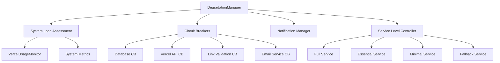

# DegradationManager - Documentation Complète

## Vue d'ensemble

Le `DegradationManager` est un système de dégradation gracieuse qui ajuste automatiquement le niveau de service en fonction de la charge système et des ressources disponibles. Il empêche les pannes complètes en réduisant progressivement les fonctionnalités lorsque le système est sous pression.

## Architecture

### Niveaux de Service

Le système définit 4 niveaux de service :

1. **FULL** - Service complet avec toutes les fonctionnalités
2. **ESSENTIAL** - Service de base avec audit uniquement
3. **MINIMAL** - Alertes critiques seulement
4. **FALLBACK** - Bascule vers GitHub Actions

### Composants Principaux



## Configuration

### Seuils de Dégradation

```typescript
const config: DegradationConfig = {
  thresholds: {
    full: {
      cpuUsage: 70,      // 70% CPU max
      memoryUsage: 70,   // 70% mémoire max
      vercelUsage: 60,   // 60% quota Vercel max
      errorRate: 2,      // 2% erreurs max
      responseTime: 5000 // 5s réponse max
    },
    essential: {
      cpuUsage: 85,
      memoryUsage: 85,
      vercelUsage: 75,
      errorRate: 5,
      responseTime: 10000
    },
    minimal: {
      cpuUsage: 95,
      memoryUsage: 95,
      vercelUsage: 90,
      errorRate: 10,
      responseTime: 15000
    },
    fallback: {
      cpuUsage: 100,
      memoryUsage: 100,
      vercelUsage: 95,
      errorRate: 20,
      responseTime: 30000
    }
  },
  checkInterval: 30000,        // Vérification toutes les 30s
  stabilityPeriod: 120000,     // 2 minutes de stabilité
  notificationCooldown: 300000 // 5 minutes entre notifications
};
```

### Circuit Breakers

```typescript
const circuitBreakers = {
  database: { threshold: 3, timeout: 30000 },
  vercel_api: { threshold: 5, timeout: 60000 },
  link_validation: { threshold: 10, timeout: 120000 },
  email_service: { threshold: 3, timeout: 300000 }
};
```

## Utilisation

### Initialisation

```typescript
import { DegradationManager } from './degradation-manager';

const degradationManager = new DegradationManager({
  checkInterval: 30000,
  stabilityPeriod: 120000,
  notificationCooldown: 300000
});

// Démarrer le monitoring automatique
degradationManager.startMonitoring();
```

### Utilisation des Circuit Breakers

```typescript
// Protéger une opération critique
try {
  const result = await degradationManager.executeWithCircuitBreaker(
    'database',
    async () => {
      // Opération de base de données
      return await database.query('SELECT * FROM users');
    },
    {
      timeout: 5000,
      threshold: 3,
      resetTimeout: 60000
    }
  );
} catch (error) {
  console.error('Opération échouée ou circuit breaker ouvert:', error);
}
```

### Monitoring Manuel

```typescript
// Vérification forcée
const status = await degradationManager.forceCheck();
console.log('État actuel:', status.currentLevel);

// Évaluation de la charge
const systemLoad = await degradationManager.assessSystemLoad();
console.log('Charge système:', systemLoad);

// État des circuit breakers
const circuitBreakers = degradationManager.getAllCircuitBreakers();
console.log('Circuit breakers:', circuitBreakers);
```

## Fonctionnalités Détaillées

### 1. Évaluation de la Charge Système

Le système évalue continuellement :

- **CPU Usage** : Pourcentage d'utilisation processeur
- **Memory Usage** : Pourcentage d'utilisation mémoire
- **Vercel Usage** : Pourcentage des quotas Vercel utilisés
- **Error Rate** : Taux d'erreur sur les 5 dernières minutes
- **Response Time** : Temps de réponse moyen
- **Active Connections** : Nombre de connexions actives

### 2. Logique de Dégradation

```typescript
// Algorithme de décision
function determineServiceLevel(systemLoad: SystemLoad): ServiceLevel {
  const levels = [ServiceLevel.FULL, ServiceLevel.ESSENTIAL, ServiceLevel.MINIMAL, ServiceLevel.FALLBACK];
  
  for (const level of levels) {
    const thresholds = config.thresholds[level];
    
    if (allThresholdsRespected(systemLoad, thresholds)) {
      return level;
    }
  }
  
  return ServiceLevel.FALLBACK;
}
```

### 3. Circuit Breaker Pattern

Chaque circuit breaker a 3 états :

- **CLOSED** : Opérations normales
- **OPEN** : Échecs détectés, opérations bloquées
- **HALF_OPEN** : Test de récupération

```typescript
// États et transitions
CLOSED --[échecs >= seuil]--> OPEN
OPEN --[timeout écoulé]--> HALF_OPEN
HALF_OPEN --[succès]--> CLOSED
HALF_OPEN --[échec]--> OPEN
```

### 4. Notifications Automatiques

Le système envoie des notifications lors de :

- Changement de niveau de service
- Ouverture/fermeture de circuit breaker
- Surcharge système détectée
- Activation du mode fallback

## Intégration avec les Autres Systèmes

### VercelUsageMonitor

```typescript
// Le DegradationManager utilise VercelUsageMonitor
const vercelMetrics = await this.usageMonitor.getCurrentUsage();
systemLoad.vercelUsage = vercelMetrics.percentageOfLimit;
```

### FallbackManager

```typescript
// Activation automatique du fallback
if (targetLevel === ServiceLevel.FALLBACK) {
  await this.fallbackManager.activateFallback('urgent');
  await this.fallbackManager.activateFallback('health');
}
```

### AlertManager

```typescript
// Intégration avec le système d'alertes
await alertManager.sendAlert({
  type: 'service_degradation',
  severity: this.getDegradationSeverity(newLevel, previousLevel),
  message: `Service dégradé: ${previousLevel} → ${newLevel}`,
  data: { systemLoad, reason }
});
```

## Base de Données

### Tables Principales

1. **degradation_logs** : Historique des changements de niveau
2. **system_metrics** : Métriques système collectées
3. **circuit_breaker_states** : État des circuit breakers
4. **circuit_breaker_events** : Événements des circuit breakers
5. **degradation_notifications** : Notifications envoyées
6. **degradation_config** : Configuration du système

### Requêtes Utiles

```sql
-- État actuel du système
SELECT * FROM degradation_logs 
ORDER BY changed_at DESC 
LIMIT 1;

-- Métriques récentes
SELECT * FROM recent_system_metrics 
WHERE measured_at >= NOW() - INTERVAL '1 hour';

-- État des circuit breakers
SELECT * FROM circuit_breaker_status;

-- Statistiques de dégradation
SELECT * FROM degradation_stats 
WHERE hour >= NOW() - INTERVAL '24 hours';
```

## Tests et Validation

### Tests Automatisés

```bash
# Exécuter les tests
npm run test:degradation

# Ou directement
tsx scripts/test-degradation-manager.ts
```

### Tests Manuels

```typescript
// Test de changement de niveau
await degradationManager.forceServiceLevel(ServiceLevel.MINIMAL, 'Test manuel');

// Test de circuit breaker
await degradationManager.executeWithCircuitBreaker('test_service', 
  async () => { throw new Error('Test'); }
);

// Réinitialisation
degradationManager.resetCircuitBreaker('test_service');
```

## Monitoring et Observabilité

### Métriques Clés

- **Service Level Changes** : Fréquence des changements de niveau
- **Circuit Breaker Events** : Ouvertures/fermetures des circuit breakers
- **System Load Trends** : Évolution de la charge système
- **Response Time Distribution** : Distribution des temps de réponse
- **Error Rate Trends** : Évolution du taux d'erreur

### Dashboards Recommandés

1. **Vue d'ensemble** : Niveau de service actuel, charge système
2. **Circuit Breakers** : État de tous les circuit breakers
3. **Historique** : Évolution des métriques sur 24h
4. **Alertes** : Notifications récentes et leur statut

### Alertes Recommandées

- Service dégradé vers MINIMAL ou FALLBACK
- Circuit breaker ouvert depuis > 5 minutes
- Charge système > 90% pendant > 2 minutes
- Taux d'erreur > 10% pendant > 1 minute

## Dépannage

### Problèmes Courants

#### 1. Service Bloqué en Mode Dégradé

```typescript
// Vérifier l'état actuel
const status = degradationManager.getCurrentStatus();
console.log('Niveau actuel:', status.currentLevel);
console.log('Raison:', status.reason);

// Forcer le retour au service complet
await degradationManager.forceServiceLevel(ServiceLevel.FULL, 'Intervention manuelle');
```

#### 2. Circuit Breaker Bloqué Ouvert

```typescript
// Vérifier l'état
const breaker = degradationManager.getCircuitBreakerStatus('service_name');
console.log('État:', breaker?.state);

// Réinitialiser
degradationManager.resetCircuitBreaker('service_name');
```

#### 3. Notifications Non Envoyées

```sql
-- Vérifier les notifications en échec
SELECT * FROM degradation_notifications 
WHERE delivery_status = 'failed' 
ORDER BY created_at DESC;
```

### Logs de Debug

```typescript
// Activer les logs détaillés
process.env.DEBUG = 'degradation:*';

// Ou dans le code
console.log('État détaillé:', {
  status: degradationManager.getCurrentStatus(),
  metrics: degradationManager.getSystemMetricsHistory().slice(-5),
  circuitBreakers: degradationManager.getAllCircuitBreakers()
});
```

## Bonnes Pratiques

### 1. Configuration des Seuils

- Commencer avec des seuils conservateurs
- Ajuster basé sur les métriques réelles
- Tester les changements en environnement de staging

### 2. Circuit Breakers

- Définir des seuils appropriés par service
- Implémenter des timeouts raisonnables
- Monitorer les taux d'ouverture/fermeture

### 3. Notifications

- Éviter le spam avec des cooldowns appropriés
- Grouper les notifications similaires
- Inclure des actions recommandées

### 4. Tests

- Tester régulièrement les scénarios de dégradation
- Valider les fallbacks en conditions réelles
- Mesurer l'impact sur l'expérience utilisateur

## Évolution Future

### Améliorations Prévues

1. **Machine Learning** : Prédiction proactive des dégradations
2. **Auto-scaling** : Ajustement automatique des ressources
3. **Métriques Avancées** : Intégration avec APM tools
4. **Dashboard Web** : Interface de monitoring en temps réel
5. **API REST** : Contrôle programmatique du système

### Intégrations Possibles

- **Prometheus/Grafana** : Métriques et dashboards
- **PagerDuty** : Alertes critiques
- **Slack/Teams** : Notifications d'équipe
- **Datadog/New Relic** : Observabilité avancée

## Support

Pour toute question ou problème :

1. Consulter les logs : `degradation_logs` et `circuit_breaker_events`
2. Vérifier la configuration : `degradation_config`
3. Tester manuellement : `scripts/test-degradation-manager.ts`
4. Contacter l'équipe technique avec les détails du problème

---

*Cette documentation est maintenue à jour avec chaque version du DegradationManager.*