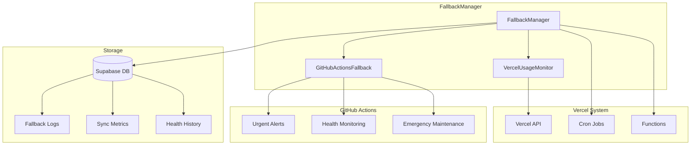

# FallbackManager - Documentation Complète

## Vue d'ensemble

Le `FallbackManager` est un système de détection automatique des pannes Vercel et de bascule vers GitHub Actions. Il fait partie intégrante de l'optimisation du plan Vercel gratuit en fournissant une solution de secours robuste.

## Architecture



## Composants Principaux

### 1. FallbackManager

**Responsabilités :**
- Détection automatique des pannes Vercel
- Évaluation de la santé du système
- Activation des fallbacks appropriés
- Synchronisation des données entre systèmes

**Configuration :**
```typescript
interface FallbackConfig {
  checkInterval: number;        // Intervalle de vérification (ms)
  maxAuditDelay: number;       // Délai max avant panne (heures)
  retryAttempts: number;       // Tentatives de retry
  retryDelay: number;          // Délai entre retries (ms)
  healthCheckTimeout: number;  // Timeout des vérifications (ms)
}
```

### 2. GitHubActionsFallback

**Responsabilités :**
- Interface avec l'API GitHub Actions
- Déclenchement des workflows de secours
- Monitoring des exécutions de fallback

**Workflows disponibles :**
- `fallback-urgent-alerts.yml` - Alertes urgentes
- `fallback-health-monitoring.yml` - Monitoring de santé
- `fallback-emergency-maintenance.yml` - Maintenance d'urgence

### 3. Interfaces de Données

#### FallbackStatus
```typescript
interface FallbackStatus {
  isVercelDown: boolean;      // Système Vercel en panne
  reason: string;             // Raison de la panne
  lastCheck: Date;            // Dernière vérification
  fallbackActive: boolean;    // Fallback actuellement actif
  nextCheck: Date;            // Prochaine vérification
}
```

#### SystemHealth
```typescript
interface SystemHealth {
  vercelCrons: 'healthy' | 'warning' | 'unhealthy' | 'unknown';
  vercelApi: 'healthy' | 'unhealthy' | 'unknown';
  database: 'healthy' | 'slow' | 'unhealthy' | 'unknown';
  lastAuditTime: Date | null;
  timeSinceLastAudit: number; // en heures
}
```

## Utilisation

### Initialisation

```typescript
import { FallbackManager } from './fallback-manager';

// Configuration par défaut
const fallbackManager = new FallbackManager();

// Configuration personnalisée
const fallbackManager = new FallbackManager({
  checkInterval: 2 * 60 * 1000,  // 2 minutes
  maxAuditDelay: 4,              // 4 heures
  retryAttempts: 5,
  retryDelay: 10 * 1000,         // 10 secondes
  healthCheckTimeout: 15 * 1000  // 15 secondes
});
```

### Vérification de Santé

```typescript
// Vérification complète du système
const health = await fallbackManager.checkSystemHealth();
console.log('Santé du système:', health);

// Évaluation du besoin de fallback
const status = await fallbackManager.shouldActivateFallback();
if (status.isVercelDown) {
  console.log('Fallback requis:', status.reason);
}
```

### Activation de Fallback

```typescript
// Activation manuelle
await fallbackManager.activateFallback('urgent');    // Alertes urgentes
await fallbackManager.activateFallback('maintenance'); // Maintenance
await fallbackManager.activateFallback('health');     // Monitoring santé

// Synchronisation des données
await fallbackManager.synchronizeData();
```

### Monitoring Continu

```typescript
// Vérification forcée (pour tests)
const status = await fallbackManager.forceCheck();

// Récupération du dernier statut
const lastStatus = fallbackManager.getLastStatus();
```

## Intégration avec les API Routes

### API Route Audit Complet

```typescript
// /api/audit-complete/route.ts
import { FallbackManager } from '@/lib/vercel/fallback-manager';

export async function GET() {
  const fallbackManager = new FallbackManager();
  
  // Vérification préliminaire
  const status = await fallbackManager.shouldActivateFallback();
  
  if (status.isVercelDown) {
    // Déléguer à GitHub Actions
    await fallbackManager.activateFallback('urgent');
    return Response.json({
      success: false,
      fallbackActivated: true,
      reason: status.reason
    });
  }
  
  // Continuer avec l'audit normal
  // ...
}
```

### API Route Maintenance Hebdomadaire

```typescript
// /api/maintenance-weekly/route.ts
import { FallbackManager } from '@/lib/vercel/fallback-manager';

export async function GET() {
  const fallbackManager = new FallbackManager();
  
  // Vérifier la santé avant maintenance
  const health = await fallbackManager.checkSystemHealth();
  
  if (health.vercelCrons === 'unhealthy') {
    await fallbackManager.activateFallback('maintenance');
    return Response.json({
      success: false,
      fallbackActivated: true,
      reason: 'Cron jobs défaillants'
    });
  }
  
  // Synchroniser les données
  await fallbackManager.synchronizeData();
  
  // Continuer avec la maintenance
  // ...
}
```

## Base de Données

### Tables Requises

Le système utilise trois tables principales dans Supabase :

1. **fallback_logs** - Historique des activations
2. **sync_metrics** - Métriques de synchronisation
3. **system_health_history** - Historique de santé

### Installation

```sql
-- Exécuter le script de setup
\i scripts/setup-fallback-db.sql
```

### Vues Disponibles

- `fallback_stats` - Statistiques agrégées
- `recent_system_health` - Santé récente (7 jours)

## GitHub Actions Workflows

### Configuration Requise

Variables d'environnement dans GitHub Secrets :
- `GITHUB_TOKEN` - Token pour déclencher les workflows
- `SENDGRID_API_KEY` - Pour les alertes email
- `SUPABASE_SERVICE_ROLE_KEY` - Accès base de données
- `ADMIN_EMAIL` - Email de l'administrateur

### Workflows de Fallback

#### 1. Alertes Urgentes (`fallback-urgent-alerts.yml`)
- **Déclenchement :** Toutes les 6h ou manuel
- **Fonction :** Audit critique et alertes immédiates
- **Durée :** ~5 minutes

#### 2. Monitoring de Santé (`fallback-health-monitoring.yml`)
- **Déclenchement :** Toutes les heures
- **Fonction :** Vérification continue de la santé
- **Durée :** ~2 minutes

#### 3. Maintenance d'Urgence (`fallback-emergency-maintenance.yml`)
- **Déclenchement :** Manuel uniquement
- **Fonction :** Maintenance corrective
- **Durée :** Variable (5-45 minutes)

## Logique de Détection

### Critères de Panne

Le système est considéré en panne si :

1. **API Vercel inaccessible** ET **Cron jobs défaillants**
2. **Cron jobs inactifs** depuis plus de `maxAuditDelay` heures
3. **Base de données inaccessible**

### Niveaux de Santé

- **healthy** - Système opérationnel
- **warning** - Problèmes mineurs détectés
- **unhealthy** - Intervention requise
- **unknown** - État indéterminé

## Gestion d'Erreurs

### Stratégies de Récupération

1. **Retry automatique** avec backoff exponentiel
2. **Fallback en cascade** (Vercel → GitHub Actions)
3. **Mode dégradé** avec fonctionnalités limitées
4. **Alertes préventives** avant pannes critiques

### Logging

Tous les événements sont enregistrés dans :
- Console (développement)
- Base de données (production)
- GitHub Issues (problèmes critiques)
- Email (alertes administrateur)

## Tests

### Tests Structurels

```bash
npx tsx scripts/test-fallback-manager-simple.ts
```

### Tests Complets (avec APIs)

```bash
# Configurer les variables d'environnement
export VERCEL_TOKEN="your-token"
export GITHUB_TOKEN="your-token"
export NEXT_PUBLIC_SUPABASE_URL="your-url"
export SUPABASE_SERVICE_ROLE_KEY="your-key"

# Exécuter les tests
npx tsx scripts/test-fallback-manager.ts
```

## Métriques et Monitoring

### Métriques Clés

- **Temps de détection** des pannes
- **Taux de réussite** des fallbacks
- **Durée moyenne** de résolution
- **Fréquence** des activations

### Alertes Configurées

- **70%** des limites Vercel - Alerte préventive
- **80%** des limites Vercel - Alerte d'attention
- **90%** des limites Vercel - Alerte critique
- **Panne détectée** - Alerte urgente

## Optimisations

### Performance

- **Cache intelligent** des vérifications de santé
- **Batch processing** des requêtes
- **Lazy loading** des modules non-critiques
- **Timeouts optimisés** pour éviter les blocages

### Ressources

- **Mémoire limitée** à 512MB par fonction
- **Timeout réduit** à 30 secondes maximum
- **Concurrence contrôlée** (3 batches simultanés)
- **Garbage collection** forcé après traitement

## Dépannage

### Problèmes Courants

1. **Token GitHub invalide**
   - Vérifier `GITHUB_TOKEN` dans les secrets
   - Régénérer le token si nécessaire

2. **Base de données inaccessible**
   - Vérifier la configuration Supabase
   - Exécuter le script de setup si nécessaire

3. **Workflows GitHub non déclenchés**
   - Vérifier les permissions du token
   - Valider la syntaxe des fichiers YAML

### Debug

```typescript
// Activer les logs détaillés
process.env.DEBUG = 'fallback:*';

// Forcer une vérification
const status = await fallbackManager.forceCheck();
console.log('Debug status:', status);
```

## Évolution Future

### Améliorations Prévues

1. **Machine Learning** pour prédiction des pannes
2. **Multi-cloud fallback** (AWS Lambda, Cloudflare Workers)
3. **Auto-scaling** basé sur la charge
4. **Métriques avancées** avec dashboards

### Extensibilité

Le système est conçu pour être facilement extensible :
- Nouveaux types de fallback
- Intégration avec d'autres services
- Personnalisation des seuils d'alerte
- Ajout de nouveaux workflows

## Conclusion

Le FallbackManager fournit une solution robuste et automatisée pour gérer les limitations du plan Vercel gratuit. Il assure la continuité de service tout en optimisant l'utilisation des ressources disponibles.

Pour toute question ou problème, consultez les logs de debug ou créez une issue GitHub avec les détails de l'erreur.