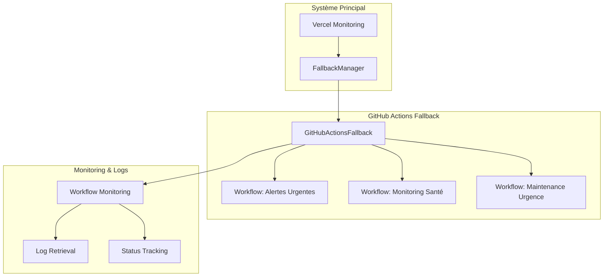

# GitHub Actions Fallback Integration

## Vue d'ensemble

L'intégration GitHub Actions Fallback fournit un système de secours robuste pour le système d'audit des liens morts. Quand les cron jobs Vercel sont indisponibles ou défaillants, le système bascule automatiquement vers des workflows GitHub Actions pour maintenir les fonctionnalités critiques.

## Architecture



## Composants Principaux

### 1. GitHubActionsFallback

Classe principale qui gère l'interaction avec l'API GitHub Actions.

**Fonctionnalités :**
- Déclenchement de workflows
- Monitoring du statut des workflows
- Récupération des logs d'exécution
- Gestion des erreurs et retry automatiques

**Méthodes principales :**
```typescript
// Déclenchement des workflows
async triggerUrgentAlerts(forceCheck?: boolean): Promise<FallbackTriggerResult>
async triggerEmergencyMaintenance(type?, severity?, notifyAdmin?): Promise<FallbackTriggerResult>
async triggerHealthMonitoring(detailedCheck?: boolean): Promise<FallbackTriggerResult>

// Monitoring et logs
async checkWorkflowStatus(runId: number): Promise<WorkflowStatus | null>
async getWorkflowLogs(runId: number): Promise<WorkflowLogs | null>
async monitorWorkflow(runId: number, options?): Promise<WorkflowStatus | null>

// Utilitaires
async listAvailableWorkflows(): Promise<Array<{id, name, path}>>
async getRecentWorkflowRuns(workflowFile: string, limit?): Promise<WorkflowStatus[]>
```

### 2. FallbackManager (Enhanced)

Le FallbackManager a été enrichi avec des méthodes pour intégrer GitHub Actions :

```typescript
// Activation du fallback
async activateFallback(type: 'urgent' | 'maintenance' | 'health'): Promise<boolean>

// Monitoring des workflows
async monitorWorkflow(runId: number, maxWaitTime?): Promise<any>
async checkWorkflowStatus(runId: number): Promise<any>
async getWorkflowLogs(runId: number): Promise<string[]>

// Gestion des workflows
async listAvailableWorkflows(): Promise<Array<{id, name, path}>>
async getWorkflowHistory(workflowFile: string, limit?): Promise<any[]>

// Configuration
isGitHubActionsConfigured(): boolean
getGitHubActionsConfiguration(): any
```

## Workflows GitHub Actions

### 1. Fallback - Alertes Urgentes (`fallback-urgent-alerts.yml`)

**Déclenchement :**
- Automatique : Toutes les 6 heures
- Manuel : Via `workflow_dispatch`

**Fonctionnalités :**
- Vérification du statut du système Vercel
- Audit critique des liens les plus importants
- Détection des problèmes critiques
- Envoi d'alertes urgentes par email
- Création d'issues GitHub pour les problèmes critiques

**Inputs :**
- `force_check` : Force la vérification même si Vercel fonctionne

### 2. Fallback - Monitoring de Santé (`fallback-health-monitoring.yml`)

**Déclenchement :**
- Automatique : Toutes les heures
- Manuel : Via `workflow_dispatch`

**Fonctionnalités :**
- Vérification complète de la santé du système
- Test de connectivité (site, Supabase, SendGrid)
- Monitoring des performances de la base de données
- Calcul du score de santé global
- Alertes préventives

**Inputs :**
- `detailed_check` : Effectue un contrôle détaillé

### 3. Fallback - Maintenance d'Urgence (`fallback-emergency-maintenance.yml`)

**Déclenchement :**
- Manuel uniquement : Via `workflow_dispatch`

**Fonctionnalités :**
- Nettoyage de la base de données
- Réinitialisation du cache
- Correction automatique des liens
- Récupération du système
- Maintenance complète

**Inputs :**
- `maintenance_type` : Type de maintenance à effectuer
- `severity` : Niveau de sévérité
- `notify_admin` : Notification de l'administrateur

## Configuration Requise

### Variables d'Environnement

```bash
# GitHub Actions
GITHUB_TOKEN=ghp_xxxxxxxxxxxxxxxxxxxx
GITHUB_REPOSITORY=owner/repo-name

# Services externes
SENDGRID_API_KEY=SG.xxxxxxxxxxxxxxxxxxxx
SENDGRID_FROM_EMAIL=noreply@example.com
SENDGRID_FROM_NAME="System Fallback"
ADMIN_EMAIL=admin@example.com

# Base de données
NEXT_PUBLIC_SUPABASE_URL=https://xxx.supabase.co
SUPABASE_SERVICE_ROLE_KEY=eyJhbGciOiJIUzI1NiIsInR5cCI6IkpXVCJ9...

# Application
NEXT_PUBLIC_BASE_URL=https://example.com
```

### Secrets GitHub

Les secrets suivants doivent être configurés dans le repository GitHub :

- `GITHUB_TOKEN` : Token avec permissions `actions:write` et `contents:read`
- `SENDGRID_API_KEY` : Clé API SendGrid pour les notifications
- `SENDGRID_FROM_EMAIL` : Email expéditeur
- `SENDGRID_FROM_NAME` : Nom expéditeur
- `ADMIN_EMAIL` : Email de l'administrateur
- `NEXT_PUBLIC_SUPABASE_URL` : URL Supabase
- `SUPABASE_SERVICE_ROLE_KEY` : Clé service Supabase
- `NEXT_PUBLIC_BASE_URL` : URL de base de l'application
- `VERCEL_TOKEN` : Token Vercel (pour vérifier le statut)

## Utilisation

### Déclenchement Manuel

```typescript
import { GitHubActionsFallback } from '@/lib/vercel/github-actions-fallback';

const fallback = new GitHubActionsFallback();

// Déclencher une alerte urgente
const result = await fallback.triggerUrgentAlerts(true);
if (result.success) {
  console.log(`Workflow déclenché: ${result.workflowUrl}`);
  console.log(`Run ID: ${result.runId}`);
}

// Surveiller le workflow
if (result.runId) {
  const status = await fallback.monitorWorkflow(result.runId, {
    maxWaitTime: 5 * 60 * 1000, // 5 minutes
    onStatusChange: (status) => {
      console.log(`Statut: ${status.status}`);
    }
  });
}
```

### Intégration avec FallbackManager

```typescript
import { FallbackManager } from '@/lib/vercel/fallback-manager';

const manager = new FallbackManager();

// Vérifier la santé du système
const health = await manager.checkSystemHealth();

// Activer le fallback si nécessaire
if (health.vercelCrons === 'unhealthy') {
  const success = await manager.activateFallback('urgent');
  if (success) {
    console.log('Fallback GitHub Actions activé');
  }
}
```

### Récupération des Logs

```typescript
// Récupérer les logs d'un workflow
const logs = await fallback.getFormattedWorkflowLogs(runId);
logs.forEach(line => console.log(line));

// Ou via FallbackManager
const managerLogs = await manager.getWorkflowLogs(runId);
```

## Monitoring et Alertes

### Types d'Alertes

1. **Alertes Urgentes** : Problèmes critiques nécessitant une intervention immédiate
2. **Alertes de Santé** : Dégradation des performances ou problèmes préventifs
3. **Alertes de Maintenance** : Résultats des opérations de maintenance

### Canaux de Notification

- **Email** : Via SendGrid pour les alertes critiques
- **GitHub Issues** : Création automatique d'issues pour le suivi
- **Logs** : Stockage dans les artifacts GitHub Actions
- **Base de données** : Enregistrement dans `fallback_logs`

## Gestion des Erreurs

### Stratégies de Retry

- **Timeout** : 30 secondes par défaut pour les appels API
- **Retry automatique** : 3 tentatives avec backoff exponentiel
- **Fallback gracieux** : Mode dégradé si GitHub Actions indisponible

### Codes d'Erreur

- `GITHUB_CONFIG_MISSING` : Configuration GitHub incomplète
- `WORKFLOW_TRIGGER_FAILED` : Échec du déclenchement
- `WORKFLOW_TIMEOUT` : Timeout lors du monitoring
- `LOG_RETRIEVAL_FAILED` : Échec de récupération des logs

## Tests

### Script de Test

```bash
# Lancer les tests complets
npm run test:github-actions-fallback

# Ou directement
tsx scripts/test-github-actions-fallback.ts
```

### Tests Inclus

1. **Configuration** : Vérification des tokens et paramètres
2. **Liste des workflows** : Récupération des workflows disponibles
3. **Historique** : Consultation des runs précédents
4. **Déclenchement** : Test de déclenchement de workflow
5. **Monitoring** : Surveillance du statut
6. **Logs** : Récupération des logs d'exécution
7. **Intégration** : Tests avec FallbackManager

## Métriques et Performance

### Métriques Collectées

- Temps de déclenchement des workflows
- Durée d'exécution des workflows
- Taux de succès/échec
- Taille des logs récupérés
- Fréquence d'activation du fallback

### Optimisations

- **Cache des statuts** : Éviter les appels API redondants
- **Batch processing** : Traitement par lots des workflows
- **Compression des logs** : Réduction de la taille des artifacts
- **Timeout adaptatif** : Ajustement selon le type de workflow

## Sécurité

### Bonnes Pratiques

- **Tokens à durée limitée** : Rotation régulière des tokens GitHub
- **Permissions minimales** : Accès restreint aux workflows nécessaires
- **Chiffrement** : Données sensibles chiffrées dans les secrets
- **Audit trail** : Traçabilité complète des actions

### Validation des Inputs

- Validation des paramètres de workflow
- Sanitisation des données utilisateur
- Vérification des permissions avant exécution

## Troubleshooting

### Problèmes Courants

1. **Token GitHub expiré**
   - Symptôme : Erreur 401 lors des appels API
   - Solution : Renouveler le token dans les secrets

2. **Workflow non trouvé**
   - Symptôme : Erreur 404 lors du déclenchement
   - Solution : Vérifier le nom du fichier workflow

3. **Timeout lors du monitoring**
   - Symptôme : Workflow ne se termine pas
   - Solution : Augmenter le timeout ou vérifier les logs

4. **Logs inaccessibles**
   - Symptôme : Erreur lors de la récupération des logs
   - Solution : Vérifier les permissions du token

### Debug

```typescript
// Activer le mode debug
process.env.DEBUG = 'github-actions-fallback';

// Vérifier la configuration
const config = fallback.getConfiguration();
console.log('Configuration:', config);

// Tester la connectivité
const workflows = await fallback.listAvailableWorkflows();
console.log('Workflows disponibles:', workflows.length);
```

## Évolution Future

### Améliorations Prévues

1. **Workflows adaptatifs** : Ajustement automatique selon la charge
2. **Intégration Slack** : Notifications via Slack
3. **Dashboard temps réel** : Interface de monitoring
4. **Auto-scaling** : Déclenchement de workflows multiples
5. **Machine Learning** : Prédiction des pannes

### Roadmap

- **Phase 1** : Implémentation de base ✅
- **Phase 2** : Monitoring avancé et alertes
- **Phase 3** : Dashboard et interface utilisateur
- **Phase 4** : Intelligence artificielle et prédiction

---

Cette intégration GitHub Actions Fallback assure la continuité de service même en cas de défaillance du système principal Vercel, garantissant ainsi une surveillance continue et des interventions rapides en cas de problème.